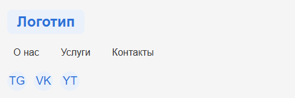

Атрибут `tabindex` управляет порядком фокусировки элементов при навигации по странице с помощью клавиши **Tab**. Обычно браузеры сами устанавливают оптимальный порядок (интерактивные элементы вроде `<a href>`, `<button>`, `<input>` и др. фокусируются по умолчанию), и мешать этому порядку вещей не нужно. Однако в сложных случаях (кастомные компоненты, динамически добавляемый контент, адаптивная вёрстка и т.п.) управление `tabindex` может пригодиться.

## Основные значения атрибута `tabindex`

* **`tabindex="0"`** – делает элемент фокусируемым и вставляет его в естественный порядок переключения (по умолчанию этот порядок определяется браузером). Например, `<div tabindex="0">…</div>` позволит получить фокус на этом блоке при табуляции так же, как если бы это был обычный интерактивный элемент.
* **`tabindex="-1"`** – исключает элемент из последовательной навигации по Tab. Элемент остаётся кликабельным и программно фокусируемым (через `.focus()`), но на него нельзя попасть при обычной табуляции. Это удобно, когда нужно, например, убрать элемент из обычного таб-цикла без отключения его кликабельности.
* **Положительные значения** (например, `tabindex="1"`, `"2"` и т.д.) – жестко задают приоритет элементов в фокус-порядке (меньшее число – раньше). На практике их использование нежелательно: фиксированный нумерованный порядок легко нарушить при добавлении новых элементов, и это «захватывает» фокус на уровне всей страницы. Поэтому лучше **не задавать положительные `tabindex` без особой необходимости**.

```html
<!-- Пример: добавляем в табуляцию див и исключаем инпут -->
<button>Кнопка 1 (по умолчанию)</button>
<div tabindex="0">Фокусируемый блок</div>
<input type="text" tabindex="-1" value="Я вне табуляции">
<button>Кнопка 2 (по умолчанию)</button>
```

<figure>
  <div style="padding: 20px; border: 1px solid black; border-radius: 5px;">
    <button>Кнопка 1 (по умолчанию)</button>
    <div tabindex="0">Фокусируемый блок</div>
    <input type="text" tabindex="-1" value="Я вне табуляции">
    <button>Кнопка 2 (по умолчанию)</button>
  </div>

<figcaption>Нажимайте Tab / Shift+Tab внутри блока</figcaption>
</figure>

При нажатии Tab фокус поочерёдно пойдёт: Кнопка 1 → Див → Кнопка 2. Поле `<input tabindex="-1">` будет проигнорировано при табуляции.

## Когда и зачем использовать `tabindex`

Как правило, **обычные элементы** (ссылки, кнопки, поля форм и т.п.) уже доступны для фокуса, и дополнительный `tabindex` не нужен. Атрибут пригодится в следующих случаях:

* **Кастомные компоненты**. Например, для удобства работы с клавиатурой в модальных окнах, аккордеонах, вкладках (`tablist`/`tabpanel`) и других виджетах можно вручную управлять фокусом. Часто для основного содержимого (например, `<div role="tabpanel" tabindex="0">…</div>`) задают `tabindex="0"`, чтобы при открытии вкладки или окна фокус попадал внутрь.
* **Динамически появившийся контент**. Если при загрузке страницы на неё дополняется важный контент (например, сообщение об ошибке или подсказка) и нужно сразу сфокусировать пользователя на нём, можно присвоить этому элементу `tabindex="-1"` и вызвать `.focus()`. Так говорят о том, что элемент не участвует в обычной табуляции, но может быть целенаправленно сфокусирован с помощью скрипта. Это важно в формах: после неудачной отправки можно перевести фокус на текст ошибки или на подсказку к полю.
* **Модификация порядка по умолчанию**. В редких ситуациях требуется изменить естественный таб-порядок. Например, если визуальный дизайн страницы предполагает нетривиальную схему фокусировки, можно вручную установить `tabindex` у нескольких элементов, чтобы заставить браузер следовать нужной последовательности. Но делать это следует осторожно и минимально: не стоит помещать в таб-цикл статические элементы вроде простых `<p>` или списков, а также следить, чтобы визуальный порядок совпадал с логическим (разметкой).

В целом можно сформулировать несколько основных правил:

* визуальный порядок элементов на странице должен совпадать с логикой их расположения в коде;
* **не изменяйте таб-порядок без острой необходимости**;
* задавайте `tabindex` лишь тем элементам, которых нет в фокусе по умолчанию, или когда нужно сменить их поведение;
* не добавляйте в таб-последовательность обычные статические элементы (параграфы, списки и т.п.) без особой причины;
* **не используйте положительные `tabindex`**, чтобы не захватить управление фокусом на уровне всей страницы.

## Адаптивная вёрстка и порядок фокусировки

В современных адаптивных макетах могут возникать проблемы: например, при использовании флексов или гридов дизайнеры часто меняют визуальный порядок элементов без изменения HTML. При этом последовательность фокуса по Tab **не изменится** – она будет идти по порядку элементов в DOM. Иными словами, если блоки «перекинуты» стилями, клавиатурные пользователи могут получать фокус «вверх-вниз» по странице в неправильном порядке.




На рисунок 1 показан следующий порядок элементов: логотип, пункты навигации и список социальных сетей. Все элемент интерактивные и не имеют `tabindex`.


На рисунке 2 дизайнер решил поменять визуально порядок элемент: логотип, список социальных сетей и только в конце пункты навигации. Если табать по интерактивным элементом, то визуально порядок сломан, так как после логотипа произойдёт перескок на навигацию. Как вы понимаете никак перескока нет, таб идёт по DOM. Такое рассогласование затрудняет клавиатурную навигацию и нарушает UX.

CSS-свойство order (в Flex или Grid-контейнерах) не влияет на таб-порядок: фокус всегда следует порядку в HTML. Чтобы синхронизировать визуальный порядок с фокусом, можно применить JavaScript — вручную расставить атрибуты tabindex по значениям, соответствующим визуальному порядку. Один из подходов:

```js
  const links = Array.from(document.querySelectorAll('.header a'));

  links
    .sort((a, b) => a.getBoundingClientRect().left - b.getBoundingClientRect().left)
    .forEach((link, idx) => (link.tabIndex = idx + 1));
```

Этот скрипт назначает каждому элементу tabIndex на основе его реального положения на экране (координаты left), благодаря чему при переходе по Tab фокус перемещается по ссылкам в том порядке, в каком они видны пользователю — слева направо. Однако с этим подходом нужно быть осторожным: если в документе есть другие интерактивные элементы без явно заданного tabindex, они могут вмешаться в общий порядок фокуса и нарушить ожидаемую логику перехода.

В сети ходит несколько вариантов это скрипта, но смысл один и тот же.

## Современное решение: `reading-flow` и `reading-order`

В предыдущем разделе мы увидели, что при использовании Flex / Grid-раскладок визуальный порядок легко «уезжает» от DOM-структуры, — и тогда остаётся либо мириться с «лестницами» фокуса, либо писать скрипты, которые переупорядочивают `tabindex`. С мая 2025 г. в Chrome 137 появилось более изящное средство, встроенное прямо в CSS: свойства `reading-flow` и `reading-order` из спецификации [CSS Display Level 4](https://www.w3.org/TR/css-display-4/#reading-flow)

### Что делает `reading-flow`

`reading-flow` объявляется у контейнера (block, flex, grid) и определяет **логический маршрут обхода** для скрин-ридеров и клавиши Tab. Вместо того чтобы жёстко задавать номера в `tabindex`, мы «обучаем» сам контейнер, как следует читать его содержимое:

| Контейнер | Ключевые значения                | Что произойдёт                                                                                                                                      |
|-----------|----------------------------------|-----------------------------------------------------------------------------------------------------------------------------------------------------|
| **Flex**  | `flex-visual`                    | Фокус переключается в том порядке, как элементы действительно расположены на экране (учитываются `flex-direction`, `order`, `row-/column-reverse`). |
|           | `flex-flow`                      | Следует оригинальному направлению потока flex-контейнера, даже если он визуально инвертирован.                                                      |
| **Grid**  | `grid-rows`, `grid-columns`      | Обход строка-за-строкой или колонка-за-колонкой, исходя из фактической сетки.                                                                       |
|           | `grid-order`                     | Сначала учитывается `order`, затем стандартное построчное чтение.                                                                                   |
| **Любой** | `normal` (значение по умолчанию) | Последовательность строго повторяет порядок в DOM.                                                                                                  |

Таким образом, контейнер с активным `reading-flow` образует *локальную область навигации*: браузер сначала обходит все его дочерние элементы, а уже потом переходит к следующему интерактивному узлу в документе. Положительные `tabindex` внутри такой области **игнорируются**, так что риск «захватить» фокус пропадает.

### Точная настройка через `reading-order`

Если одного режима `reading-flow` недостаточно, на помощь приходит `reading-order`: задаём его отдельному потомку контейнера и присваиваем целое число-приоритет. Элемент с меньшим числом получит фокус раньше. Например, чтобы ссылка «Пропустить к содержимому» всегда была первой, достаточно прописать ей `reading-order: -1`, а у контейнера оставить любой режим, отличный от `normal`.

> **Важно:** если несколько потомков получают одинаковый `reading-order`, окончательный порядок выбирается согласно `reading-flow`.

### Применение к нашему примеру

Ранее мы решали проблему несовпадения DOM-и визуального порядка в `<header>` при помощи JavaScript, динамически расставляя `tabindex`. Теперь скрипт можно убрать и заменить одной строкой CSS:

```css
/* Мобильная версия: логотип → навигация → соцсети */
.header {
  display: grid;
  grid-template-areas:
    "logo"
    "nav"
    "social";

  /* Читаем строки сверху вниз — совпадает с визуальным порядком */
  reading-flow: grid-rows;
}

@media (min-width: 700px) {
  /* Десктоп: логотип → соцсети → навигация */
  .header {
    grid-template-areas: "logo social nav";
    align-items: center;

    /* Теперь логичный маршрут — по колонкам слева направо */
    reading-flow: grid-columns;
  }
}
```

Клавиатурный обход будет совпадать с макетом на обеих ширинах, а лишний JS исчезнет.
