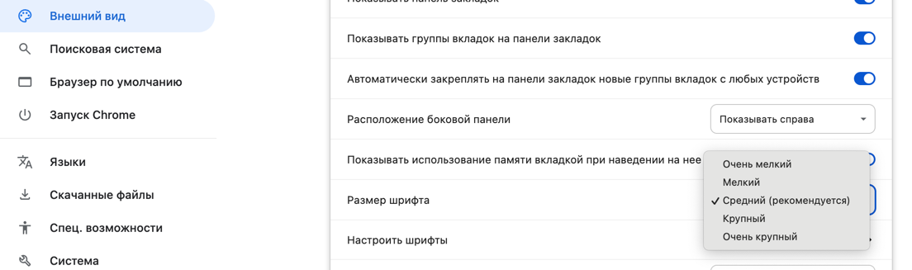
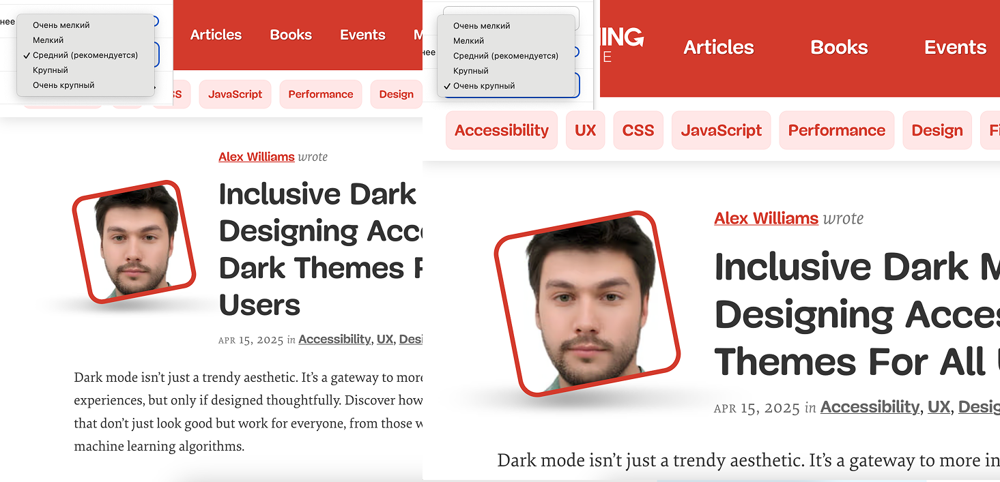

Шрифт и его размер давно считаются важной частью пользовательского опыта на сайте, однако многие разработчики и дизайнеры до сих пор подходят к этим настройкам так, будто базовый размер текста всегда останется `16px`. На самом деле браузерные настройки позволяют пользователям выбирать предпочтительный размер шрифта, но далеко не всегда этот выбор действительно работает так, как нужно людям.



Фактические размеры:
- Очень мелкий (xx-small): примерно 10 пикселей
- Мелкий (small): примерно 13 пикселей
- Средний (medium): 16 пикселей (значение по умолчанию)
- Крупный (large): примерно 18 пикселей
- Очень крупный (x-large): примерно 24 пикселя

Эти значения могут незначительно отличаться в зависимости от настроек операционной системы и масштабирования экрана. Эти зависимости не будут рассматриваться в этой статье.

Основная проблема кроется в том, что мы привыкли воспринимать «`1em`» как `16px`, а это не всегда верно. Пользователь может указать в настройках значение по умолчанию в `24px` или больше, и тогда любой жёстко заданный или «привязанный» к 16 пикселям размер нарушит задуманный баланс. В итоге человек, который действительно хотел видеть шрифт в районе `24px`, вдруг получает `36px` – и вынужден отказываться от своих предпочтений, так как сайты оказываются чрезмерно «увеличенными».

Часто мы даже не замечаем, что наше желание «зафиксировать» дизайн приводит к неверной интерпретации пользовательских настроек. Многие сайты попросту исходят из «стандартных» `16px`, не учитывая альтернативных вариантов, и вносят исправления вроде «`1.5em`» для получения примерно `24px`. Но такое приближение ломается, когда реальный базовый размер уже превышает `16px`.

<figure>

  

  <figcaption>
    Базовый шрифт сайта указан в «1.5em» поэтому пользователь указав "Очень крупный"(`24px`) в настройках браузера получает гораздо больший размер шрифта.
  </figcaption>
</figure>

Выходит, что разработчики фактически игнорируют настройку пользователя, делая шрифт ещё больше (или, наоборот, слишком маленьким, если кто-то использует значения меньше 16px). В результате ломается та самая цель, ради которой пользователь решил настроить шрифт: удобное чтение в своём браузере и на своём устройстве.

## «Не указывайте» – зачастую лучшая стратегия

Есть простой совет, о котором многие не подозревают: не задавайте базовый размер шрифта вообще. Пусть html остаётся без команды `font-size`, используя настройки пользователя по умолчанию.

```css
html {
  /* не указывайте размер – пусть работает настройка пользователя */
}
```

Это позволяет браузеру корректно интерпретировать предпочтения, и если кто-то действительно выбрал 24px в качестве базового значения, то ваш сайт адаптируется под эту установку.

## Зачем нужна отзывчивость шрифта
Может возникнуть вопрос: «Почему бы не выбрать одну размерность и остановиться на этом?» Дело в том, что один и тот же размер (скажем, `24px`) на экране смартфона может показаться огромным, а на широком мониторе — в самый раз. При этом, если вы привыкли менять размеры окон браузера или подключаете/отключаете внешний монитор, логично, что шрифт не должен быть статичным.

Один из способов привнести плавную адаптацию — использовать не просто «1em», а формулы вроде:

```css
html {
  font-size: calc(1em + 1vw);
}
```

Таким образом, ваш шрифт подстраивается к ширине окна (viewport width). При этом важно не забывать о крайних значениях: слишком маленький шрифт в узких окнах и слишком огромный — в широких. Поэтому часто применяют `clamp()`:

```css
html {
  font-size: clamp(1em, 0.9em + 1vw, 1.5em);
}
```

Это даёт определённую гибкость, но при этом не пытается «угадать» точное число пикселей, а работает исключительно в относительных единицах, исходя из предпочтений пользователя.

## Как учитывать разные сценарии
На практике бывают ситуации, где человек хочет большой шрифт для чтения длинных статей, но более компактный — для, например, просмотра банковских выписок. Переключаться каждый раз в настройках браузера неудобно. Решением может стать собственная панель на сайте, позволяющая корректировать размер именно для этого ресурса. Но в любом случае по умолчанию стоит опираться на значение, выбранное в браузере.

Важно понимать, что когда разработчики «жёстко» прописывают размер и рассчитывают «`1em` = `16px`», они не только не уважают выбор пользователя, но и создают проблемы для будущих технологий и сценариев использования. Люди действительно ресайзят окна и меняют девайсы, даже если это кажется редкой практикой.

На данный момент у меня нет единого рецепта "как делать правильно", но есть понимание, что нужно уважать выбор пользователя на изменение размера шрифта.

PS: обратите внимание, что на этом сайте минимальный размер шрифта `20px`, который указывает следующим образом:

```css
:root {
  --text-lg: clamp(1.25rem, 1.15rem + 0.65vw, 1.5rem);
}

body {
  font-size: var(--text-lg);
}
```

Если пользователь не поменяет размер шрифта в браузере, то результат будет: `16px * 1.25rem` = `20px`, а если изменит на "Очень крупный", то `24px * 1.25rem = 30px`, что является действительно крупным размером относительно базового размера.

## Источники
- [Reimagining Fluid Typography](https://www.oddbird.net/2025/02/12/fluid-type/)
