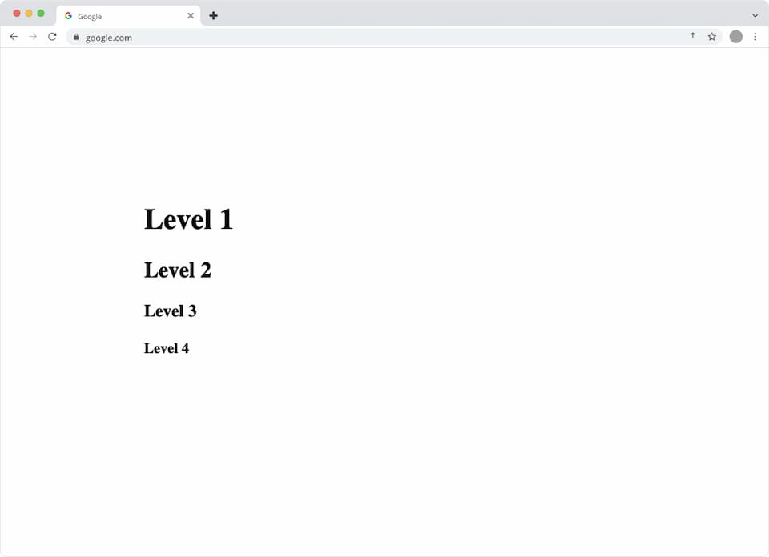
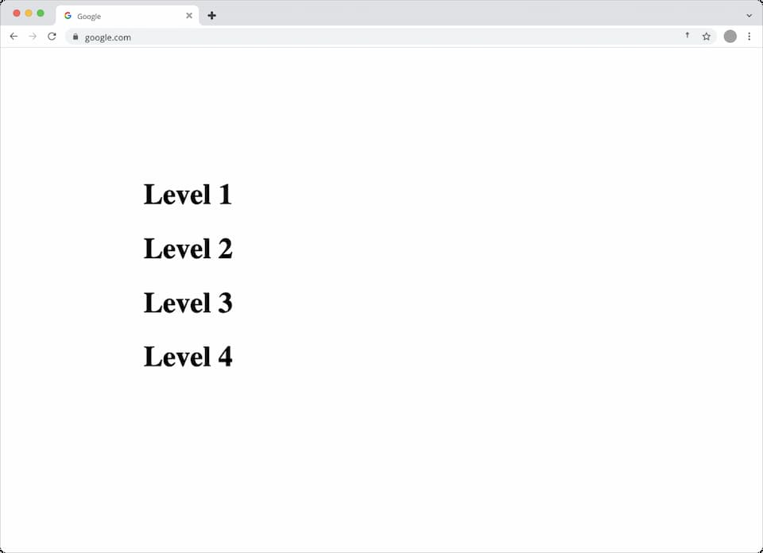

## Коротко

Ранее браузеры, обрабатывая `<h1>`, вложенные в секции, применяли к ним стили, которые визуально снижали их уровень (например, делая их похожими на `<h2>` или `<h3>` в зависимости от глубины вложенности). Речь идёт о стандартных стилях по умолчанию браузера. В скором времени все `<h1>` будут отображаться одинаково, поэтому для предотвращения проблем проверьте, что для заголовков в ваших проектах заданы явные стили.

## Подробнее
Изначально HTML-спецификация содержала алгоритм структурирования, который назначал элементам `<h1>` неявный семантический уровень в зависимости от количества вложенных семантических контейнеров (таких как `<section>`, `<aside>`, `<nav>` и `<article>`). Так, элемент `section > h1` имел стили, аналогичные `<h2>`, элемент `section > section > h1` — как `<h3>` и так далее. Однако рендеринг браузеров реализовывал лишь визуальное представление этих уровней посредством стилей User Agent, а само дерево доступности не менялось.

Это приводило к тому, что разработчики, используя секционирующие элементы, не ожидали автоматического изменения уровней заголовков. В результате возникала путаница: одни инструменты обрабатывали HTML по-своему, а алгоритм обводки (outline algorithm) стал считаться проблематичным. Так, алгоритм [был исключён из спецификации в 2022 году](https://github.com/whatwg/html/pull/7829), а устаревшие правила UA-стилей постепенно удаляются из браузеров.

Например, раньше браузер мог устанавливать следующие стили:
```css
/* где x это :is(article, aside, nav, section) */
x h1 { margin-block: 0.83em; font-size: 1.50em; }
x x h1 { margin-block: 1.00em; font-size: 1.17em; }
x x x h1 { margin-block: 1.33em; font-size: 1.00em; }
x x x x h1 { margin-block: 1.67em; font-size: 0.83em; }
x x x x x h1 { margin-block: 2.33em; font-size: 0.67em; }
```

Пример HTML-разметки:

```html
<body>
  <h1>Уровень 1</h1>
  <section>
    <h1>Уровень 2</h1>
    <section>
      <h1>Уровень 3</h1>
      <section>
        <h1>Уровень 4</h1>
      </section>
    </section>
  </section>
</body>
```

В старых UA-стилях внешний вид этих заголовков выглядел так, как будто они имели разные уровни,



а в новых браузерах стили будут унифицированы – все элементы `<h1>` получат один и тот же набор стилей, без автоматического «понижения» до уровня `<h2>` или ниже.



## Когда изменения вступят в силу?

- Firefox:
    - Начиная с 31 марта 2025 года, изменения будут применяться для 50% пользователей бета-версии Firefox 138 на десктопах.
    - Затем на стабильной версии Firefox 138 изменение коснётся 5% пользователей, с постепенным увеличением до 50% и окончательным внедрением в Firefox 140.
    - Уже с Firefox 136 разработчики могут видеть консольные предупреждения для `<h1>` в упомянутых элементах, если не заданы стили.
    - Для тестирования новой функциональности можно изменить параметр layout.css.h1-in-section-ua-styles.enabled в about:config.
- Chrome:
    - Начиная с версии 136, Chrome выводит предупреждения для `<h1>` в указанных секторах, если используется дефолтный уменьшенный размер шрифта.
    - Такие предупреждения могут негативно сказаться на оценке сайта по критериям «Best Practices» в Lighthouse.
- Safari:
  - Пока нет явных багов, связанных с этими изменениями, но можно ожидать, что WebKit последует аналогичной логике обновлений.

## Как исправить предупреждения
Чтобы избежать предупреждения, необходимо явно задавать стили для элементов `<h1>`. Рекомендовано добавить следующий CSS-код в ваш проект:
```css
h1 {
  margin-block: 0.67em;
  font-size: 2em;
}
```

Если вам нужно избежать конфликта с другими правилами, можно использовать селектор :where(), который не увеличивает специфичность:
```css
:where(h1) {
  margin-block: 0.67em;
  font-size: 2em;
}
```

## Источники
- [Default styles for h1 elements are changing](https://developer.mozilla.org/en-US/blog/h1-element-styles/)
