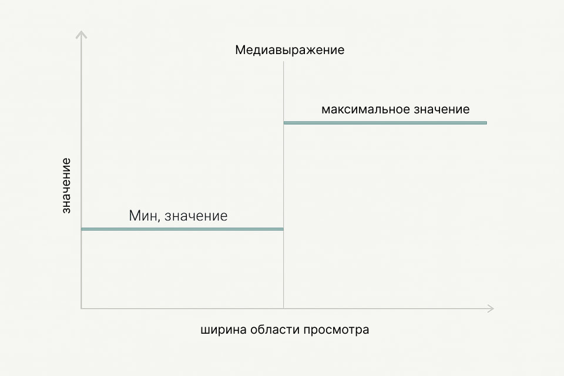
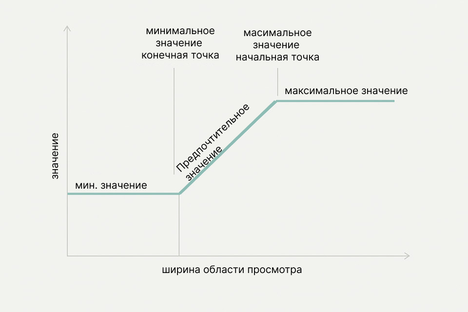

**Жидкая типографика** (`fluid typography`) – это метод задания размеров текста так, чтобы они гладко изменялись в зависимости от размеров экрана (viewport) без резких скачков. В традиционном адаптивном дизайне размеры шрифтов меняются ступенчато на определённых брейкпоинтах (с помощью медиавыражений): дизайнер задаёт размеры для, например, мобильного, планшета и десктопа, и разработчик переключает их на этих точках. В отличие от этого, жидкая типографика обеспечивает плавное масштабирование – размеры шрифта постепенно увеличиваются или уменьшаются вместе с шириной экрана, оставаясь в заданных границах. Это позволяет избежать ситуаций, когда текст выглядит неуместно на экране чуть шире или уже заданного брейкпоинта

<figure>

  
  <figcaption>Рис. 1: При классическом адаптивном подходе размер текста остаётся минимальным до медиавыражения, затем скачкообразно переходит к максимальному значению на определённой ширине экрана (брейкпоинте). Такой дискретный переход может вызывать несоответствия в промежуточных размерах экранов.</figcaption>
</figure>


**Почему это важно?** Жидкая типографика позволяет заголовкам и тексту масштабироваться плавно на любых промежуточных разрешениях. Это снижает необходимость тонкой подгонки под множество брейкпоинтов и упрощает код, устраняя дополнительные медиавыражения. В результате текст сохраняет оптимальные пропорции и читабельность на экранах любых размеров – от небольших смартфонов до крупных мониторов. Кроме того, fluid-типографика помогает поддерживать визуальную иерархию: крупные заголовки не выглядят громоздкими на маленьких экранах, а основной текст не становится слишком мелким на больших. Все это повышает адаптивность и универсальность дизайна.

<figure>

  
  <figcaption>Рис. 2: При жидкой типографике размер текста имеет минимальное значение на маленьких экранах, начинает плавно расти после заданной точки (конец минимального значения) и достигает максимума к другому пороговому значению (начало максимального значения). Далее размер фиксируется на максимуме. За счёт этого изменения происходят постепенно, без резких скачков, и текст "подстраивается" под размер экрана.</figcaption>
</figure>

Важно понимать, что жидкая типографика не отменяет полностью медиавыражения. В определённых случаях фиксация размера на пределе (минимуме или максимуме) всё равно нужна. Например, можно задать, что шрифт растёт от `320px` до `1200px` ширины экрана, а за этими пределами остаётся не меньше и не больше заданных размеров. Таким образом, fluid-подход дополняет классическую адаптивную типографику, делая её более гибкой.

## CSS-единицы измерения для fluid-типографики
Процентные единицы (`%`) задают значение относительно родительского элемента. Например, если у контейнера `<div>` установлен `width: 50%`, его ширина составит половину ширины родителя. Для шрифтов же `%` обычно используется на самом верхнем уровне: установка `font-size: 100%` для элемента `<html>` означает, что базовый размер шрифта страницы равен 100% от размера шрифта по умолчанию в браузере. Браузеры обычно имеют базовый размер `~16px`, поэтому `100%` соответствует примерно `16px`, а, скажем, `50%` — `8px`.

Процентная единица удобна для начальной настройки: рекомендуется задавать размер шрифта HTML равным `100%` (или просто не переопределять его), чтобы базовый шрифт соответствовал предпочтениям пользователя. Это улучшает доступность: пользователь может изменить базовый размер шрифта в настройках браузера, и `100%` отразит это изменение. В результате вся типографическая система, построенная на относительных единицах, масштабируется согласно пользовательским предпочтениям.

## `Em`
`Em` – классическая типографская единица, изначально равная ширине заглавной буквы "M" данного шрифта. В CSS 1em соответствует текущему размеру шрифта родителя. Таким образом, `font-size: 2em` делает элемент в два раза больше шрифта его контейнера. Например, если у `<html>` задан размер шрифта `100%` (`16px`), то элемент с `font-size: 2em` внутри будет иметь размер `2 * 16px = 32px`.

Особенность `em` – накапливающийся эффект в иерархии. Если вложить элементы с относительными размерами, вычисленный размер может быть неочевидным. Например, при базовом размере `16px`, если для секции задан `font-size: 1.5em` (то есть `24px`), а для абзаца внутри неё f`ont-size: 0.75em`, то размер шрифта абзаца будет не `0.75 * 16 = 12px`, как можно было бы подумать, а `0.75 * 24 = 18px`, так как он рассчитывается относительно родителя (секции) с уже увеличенным шрифтом. Поэтому при использовании `em` важно контролировать вложенность – несколько вложенных масштабирований могут неожиданно увеличить или уменьшить текст.

В контексте fluid-типографики `em` часто используют для задания относительных размеров элементов относительно базового текста. Например, можно задать размер шрифта для всего документа с помощью fluid-подхода, а размеры заголовков — в `em` от этого базового размера. В таком случае крупные тексты будут масштабироваться синхронно с основным текстом, сохраняя пропорции.

## `Rem (root em)`
Чтобы избежать проблемы накопления `em` при вложенности, в CSS введена единица `rem` (`root em`). `1rem` всегда равен размеру шрифта корневого элемента (`<html>`), независимо от глубины вложенности. Если в `<html>` установлен базовый размер шрифта `16px` (`100%`), то `1rem` будет равняться `16px` во всём документе (пока пользователь или медиавыражения не изменят базовый размер). Таким образом, `rem` обеспечивает стабильную отправную точку для масштабирования текста.

В современной адаптивной типографике `rem` обычно используется для заданий базовых размеров текстовых элементов. Например, основной текст можно сделать `1rem` (равным базовому размеру), подзаголовки – `1.25rem`, `1.5rem` и так далее. Относительность к корню означает, что если пользователь в браузере увеличит базовый размер шрифта (например, до `18px`), то все элементы на странице, заданные в `rem`, пропорционально увеличатся, сохраняя дизайн, но будучи крупнее. В отличие от пикселей, которые при таком увеличении не изменятся и могут привести к тому, что пользовательские настройки не возымеют эффекта. Именно поэтому использование `rem` вместо `px` для шрифтов считается лучшей практикой с точки зрения доступности.

Пример: если пользователь настроил базовый шрифт браузера на `20px` вместо `16px`, то элемент с `font-size: 1rem` будет `20px` (вместо `16px`), тогда как `font-size: 16px` останется `16px` и текст может оказаться слишком мелким для этого пользователя. Таким образом, `rem` и `em` адаптируются к предпочтениям пользователя, а `px` – `нет`.

## Единицы viewport: vw и vh
Viewport-единицы позволяют задавать размеры относительно размеров окна браузера. Основные из них: `vw` (viewport width) – `1%` от ширины viewport, и `vh` (viewport height) – `1%` от высоты viewport. Например, на устройстве с шириной экрана `375px` `100vw` равен `375px`, а `50vw` – `187.5px`. Эти единицы сразу задают адаптивное значение: если окно станет шире или уже, значения в `vw/vh` автоматически изменятся.

Использование viewport-единиц для шрифта делает его по определению резиновым: например, `font-size: 4vw` означает "`4%` от ширины окна". На упомянутом экране `375px` это около `15px`, на планшете `768px` – примерно `30.7px`, а на широком дисплее `1440px` – `57.6px`. То есть текст сам масштабируется при изменении ширины – вроде бы идеально для адаптивности.

Однако у чистых `vw/vh` есть серьёзные недостатки для типографики. Во-первых, масштабирование может быть слишком сильным: то, что на мобильном выглядело комфортно (`15px`), на десктопе превращается в `58px` – огромный текст, непригодный для основного абзаца. Контролировать такой рост сложно – мелкий текст может стать диспропорционально большим на больших экранах. Во-вторых, размеры в `vw/vh` не зависят от базового размера шрифта. Это значит, что если пользователь увеличит базовый шрифт в браузере, элементы с размером в `vw` не изменятся, ведь они привязаны к пикселям экрана, а не к настройкам текста. Более того, при масштабировании страницы сам viewport меняется (увеличивается как бы виртуально), и текст в `vw` может вообще не увеличиться при зуме – пользователь пытается приблизить страницу, а текст остаётся мелким, потому что ширина viewport условно растёт и процент от неё остаётся прежним Это напрямую затрагивает требования доступности: WCAG требует, чтобы текст можно было увеличить на `200%` без потери контента. Если текст задан через `vw` и не масштабируется должным образом при зуме, это может быть нарушением критерия [1.4.4 (Resize text) WCAG](https://www.digitala11y.com/understanding-sc-1-4-4-resize-text/), [Understanding SC 1.4.4: Resize Text (Level AA)](https://www.w3.org/WAI/WCAG21/Understanding/resize-text.html).

Вывод: `vw/vh` удобны для создания fluid-эффекта, но редко применяются в чистом виде для всего текста. Обычно их комбинируют с другими единицами или ограничивают диапазоном. Например, крупные заголовки можно частично привязать к ширине экрана через `vw`, но мелкий текст лучше не делать на 100% зависящим от viewport. Далее мы рассмотрим, как сочетать viewport-единицы с `rem` и использовать функцию `clamp()`, чтобы получить преимущества fluid-типографики без минусов.

## Функция CSS `clamp()`
CSS-функция `clamp()` позволяет задать значение с ограничением снизу и сверху – идеальный инструмент для fluid-типографики.

Синтаксис: clamp(`минимум`, `предпочтительное`, `максимум`).

Браузер вычисляет это как max(минимум, min(предпочтительное, максимум)), то есть берёт предпочтительное значение, но не ниже минимума и не выше максимума.

Простыми словами, clamp() возвращает значение, которое:
- будет равно минимуму, если вычисленное предпочтительное значение меньше минимального порога;
- будет равно максимуму, если предпочтительное больше максимума;
- а иначе возьмёт само предпочтительное значение.

Это отлично подходит для шрифтов: мы можем указать минимальный размер текста, максимальный, а между ними – формулу на основе `vw`, которая даёт плавное изменение. Получается, что текст масштабируется с ростом экрана, но не становится меньше оговоренного минимума (на очень узких экранах) и не превышает максимум (на сверхшироких). По сути, эффект такой же, как при fluid-типографике через комбинацию медиавыражений, но всё выражается одной строкой CSS без единого медиавыражения

```css
/* Абзац будет масштабироваться от 1rem до 1.5rem в зависимости от ширины экрана */
p {
  font-size: clamp(1rem, 2.5vw, 1.5rem);
}
```

Здесь для `<p>` задан минимальный размер `1rem` (`~16px`), предпочтительный — `2.5vw` (`2.5%` от ширины экрана), и максимальный — `1.5rem` (`~24px`). Браузер будет рассчитывать размер как `2.5vw`, но никогда не даст меньше `16px` и больше `24px`. Если на узком экране `2.5vw `окажется меньше `16px`, то размер сохранится `16px`; на очень широком экране `2.5vw` может превысить `24px` – тогда сработает потолок `24px`.

В контексте fluid-типографики внутри `clamp(`) обычно комбинируют viewport-единицы и `rem`. Например:

```css
h1 {
  font-size: clamp(2rem, 4vw + 1rem, 3rem);
}
```

Такой код означает: размер `h1` минимум `2rem`, максимум `3rem`, а между ними — формула `4vw + 1rem`. При узком экране значение `4vw + 1rem` может быть меньше `2rem`, но clamp удержит `2rem`. Затем по мере роста экрана `4vw` прибавляет всё больше, пока на каком-то ширине (брейкпоинте fluid-диапазона) сумма `4vw + 1rem` не превзойдёт `2rem` – после этой точки заголовок начнёт плавно увеличиваться. Наконец при достижении верхнего порога экрана формула даст `3rem`, и после этого `clamp` больше не позволит расти. В итоге мы получили плавный рост от `2rem` до `3rem`, привязанный к ширине экрана, но ограниченный разумными пределами.

Браузерная поддержка `clamp()` [сегодня отличная](https://caniuse.com/css-math-functions) – все современные браузеры её реализуют. Эта функция существенно упростила fluid-типографику: раньше для подобного эффекта приходилось вручную рассчитывать формулы с `calc()` и использовать `min()/max()` или медиавыражения, сейчас всё лаконичнее. Важно: предпочтительное значение внутри `clamp()` само может быть выражением (например, `4vw + 1rem` как выше). Это даёт большую гибкость, но помните, что часть выражения с `vw` не чувствительна к изменениям пользовательских настроек шрифта, поэтому комбинирование с `rem` обеспечивает компромисс.


## Рекомендации по реализации жидкой типографики
### 1. Базовый размер шрифта и уважение пользовательских настроек
Первый шаг – правильно задать базовый размер текста и сделать его адаптивным. Как упоминалось, хорошей практикой является установить в CSS:

```css
html {
  font-size: 100%;
}
```

Это означает, что базовый шрифт сайта равен базовому шрифту браузера пользователя. Таким образом, если пользователь в настройках предпочёл увеличенный размер (например, `18px` вместо типичных `16px`), ваш сайт унаследует это. Не рекомендуется задавать базовый шрифт фиксированно в `px`, так как это игнорирует предпочтения и может ухудшить доступность.

Далее, для всего основного текста (например, `body`) можно использовать `rem` или процент для небольшого глобального масштабирования, либо сразу применить fluid-подход. Например:

```css
body {
  font-size: 1rem; /* основной текст ~16px */
  line-height: 1.5;
}
```

Здесь `line-height: 1.5` (без единиц) задаёт межстрочный интервал в относительных единицах — это тоже best practice: такой line-height масштабируется автоматически при изменении размера шрифта.


Чтобы сделать основной текст fluid, можно применить `clamp()` к `body` или `<html>`:

```css
html {
  font-size: clamp(0.875rem, 1vw + 0.5rem, 1.125rem);
}
```

Этот пример задаёт базовый размер шрифта от `~14px` до `~18px` (`0.875rem–1.125rem`) в зависимости от ширины экрана, с небольшим влиянием `1vw`. На очень маленьких экранах шрифт не станет меньше `~14px`, а на очень больших – не больше `~18px`. Зато между, скажем, `320px` и `1200px` ширины он плавно увеличится примерно с `14px` до `18px`. Все элементы, заданные в `rem`, будут следовать этому изменению. Такой подход подходит для общего масштабирования всей типографики синхронно.

**Учитывайте доступность**: если вы применяете fluid-типографику, обязательно протестируйте, как масштабируется текст при увеличении страницы на `200%`. Браузеры обычно при зуме увеличивают pixel-координаты (включая viewport единицы), поэтому комбинация `vw + rem` может вести себя неочевидно. В частности, доля, заданная в `vw`, не увеличится при "Zoom", из-за чего итоговое увеличение шрифта может оказаться меньше `200%`. Если использование `vw` или ограничение через `clamp()` мешает достигнуть 200%-го увеличения текста, это считается ошибкой WCAG 1.4.4. Чтобы избежать проблемы, убедитесь, что при масштабировании браузера (`Ctrl + Plus` или настройках масштаб текста) ваш текст всё ещё может увеличиться достаточно. Один из подходов – не делать вклад `vw` слишком большим в формуле. Практические рекомендации: убедитесь, что при нулевом зуме ваша `rem`-составляющая в `clamp()` не меньше `1rem` (то есть 100% базового размера). Тогда при пользовательском увеличении базы на `200%` эта часть удвоится, и даже если `vw` часть останется неизменной, общий рост будет близок к `200%`. Кроме того, не отключайте возможность масштабирования: тег `<meta name="viewport" ...>` не должен включать `user-scalable=no`. На мобильных устройствах не препятствуйте работе механизма динамического изменения текста (например, свойство `-webkit-text-size-adjust` лучше оставить по умолчанию, чтобы iOS могла при необходимости увеличить текст для пользователей с нарушением зрения).

### 2. Пропорции заголовков и типографическая шкала
Когда базовый размер задан, нужно определить отношения размеров для разных уровней текста – заголовков разных уровней, подзаголовков, основного текста, мелких вспомогательных надписей и так далее. Создание типографической шкалы помогает поддерживать визуальную согласованность. Шкала – это набор размеров, обычно образующих геометрическую прогрессию с некоторым коэффициентом (называемым modular scale или модулярной шкалой). Например, классическая шкала – увеличивать размер шрифта каждого уровня заголовка на 20–25% относительно уровня ниже. Если основной текст `1rem` (`16px`), то:
- H6 `~1.25rem` (`20px`),
- H5 `~1.5rem` (`24px`),
- H4 `~1.8rem` (`~29px`),
- H3 `~2.25rem` (`36px`),
- H2 `~2.75rem `(`44px`),
- H1 `~3.25rem` (`52px`)

и так далее. Это лишь пример – коэффициент можно подобрать под дизайн (часто используются множители `1.125`, `1.25`, `1.333`, `1.414` или золотое сечение `~1.618` для особо крупной типографики).

Однако фиксированная шкала не учитывает разные экраны. Fluid-подход позволяет сделать шкалу тоже адаптивной. Например, можно задать, чтобы на маленьких экранах использовалась более скромная шкала (меньший коэффициент), а на больших – более крупная. Крупные заголовки, уместные на десктопе, на мобильном могут чрезмерно доминировать и занимать слишком много места. Решение – менять масштаб динамически от устройства (мобилка, планшет, десктоп).

Один из методов – использовать разные значения `clamp()` для каждого уровня, рассчитав их так, чтобы на мобильном размеры были ближе друг к другу, а на десктопе – разница больше. Например:

```css
h1 {
  font-size: clamp(2rem, 5vw + 1rem, 4rem);
}

h2 {
  font-size: clamp(1.5rem, 4vw + 0.875rem, 3rem);
}

p {
  font-size: clamp(1rem, 2vw + 0.5rem, 1.25rem);
}

.small-note {
  font-size: clamp(0.875rem, 1vw + 0.5rem, 1rem);
}
```

Здесь мы задали приблизительную шкалу:
- на маленьком экране:
  - `h1≈2rem` (`32px`),
  - `h2≈1.5rem` (`24px`),
  - обычный текст `~1rem` (`16px`),
  - мелкий текст `~0.875rem` (`14px`).
- На большом экране
  - `h1` вырастет до `~4rem` (`64px`),
  - `h2` до `~3rem` (`48px`),
  - основной текст до `~1.25rem` (`20px`),
  - а мелкий, скажем подписи, до `~1rem` (`16px`).

Таким образом, разница между основным текстом и заголовками увеличивается на широких экранах, обеспечивая эффектный крупный заголовок, но на узких экранах эта разница сглажена, чтобы всё оставалось читабельным и гармоничным.

Обратите внимание: большим текстовым элементам можно давать больший разброс между `min` и `max`, а мелким – меньший. Например, крупный заголовок `h1` может меняться от `32px` до `64px` (двукратный рост), тогда как базовый текст – от `14px` до `20px` (`~1.4` раза). Это логично: заголовки "дышат" пространством больше, а мелкий текст должен оставаться читабельным, его нельзя делать слишком маленьким на мобильном или слишком огромным на десктопе. Практика показывает, что fluid-типографика лучше всего подходит для крупных, заметных элементов (герои, большие заголовки, промо-тексты), где диапазон размеров значителен. Для мелких элементов (меню, подписи, кнопки) иногда удобнее оставить фиксированный или менее вариативный размер, чтобы не нарушить их читабельность.

### 3. Использование кастомных свойств для масштабируемой системы
Современные CSS-возможности, такие как кастомные свойства (custom properties), позволяют сделать типографическую систему гибкой и удобной для поддержки. Рекомендуется выносить ключевые значения – базовый размер, коэффициент масштабирования, шаги шкалы – в переменные в `:root`. Это упростит настройку типографики или изменение дизайна в будущем.

Пример: определение типографической шкалы с переменными

```css
:root {
  /* Базовый размер текста (можно также задать через clamp для fluid-базы) */
  --font-base: 1rem;

  /* Масштабные коэффициенты для разных уровней (относительно базы) */
  --scale-sm: 0.875;  /* мелкий текст */
  --scale-lg: 1.25;   /* средний заголовок */
  --scale-xl: 2.0;    /* крупный заголовок */
}

/* Применение переменных */
body {
  font-size: var(--font-base);
}

h1 {
  font-size: calc(var(--font-base) * var(--scale-xl));
}

h2 {
  font-size: calc(var(--font-base) * var(--scale-lg));
}
.small-note {
  font-size: calc(var(--font-base) * var(--scale-sm));
}
```

В этом коде мы задаем относительные размеры заголовков и мелкого текста через переменные. Если нам понадобится подправить пропорции, достаточно изменить значение переменной `--scale-xl` или другие, а не проходить по всем селекторам.

Конечно, можно задать переменные и для конкретных размеров, включая `clamp()`. Например:

```css
:root {
  --h1-min: 2rem;
  --h1-max: 4rem;
  --h1-preferred: 5vw + 1rem;
}

h1 {
  font-size: clamp(var(--h1-min), var(--h1-preferred), var(--h1-max));
}
```

Такие переменные улучшат читабельность: вместо магических чисел видно смысловые – минимальный и максимальный размер для `h1`. Это особенно удобно, если дизайн обновится и нужно будет скорректировать диапазоны или формулу – правки делаются в одном месте. Можно завести подобные переменные для каждого типа текста (`h2,` `p`, и так далее) или вычислять их на основе базовых, как в примере выше.

При построении масштабируемой типографической системы с переменными и `clamp()` полезно также определить переменные для точек перелома fluid-масштабирования – то есть до какого размера экрана сохраняется минимальный размер, и с какого начинается максимальный. Например, `--fluid-start: 320px`, `--fluid-end: 1200px`. На основе этих значений можно вычислять коэффициент при `vw`. Хотя CSS не позволяет напрямую делать сложные вычисления с условием (нужно или ручной расчет, или препроцессор), можно воспользоваться известными формулами. В предыдущем примере с `h1` формула `5vw + 1rem` выбрана не случайно – её параметры можно рассчитать, зная желаемые точки начала/конца роста. Если требуется точное соответствие (например, шрифт начинает расти от `400px` и достигает максимума в `1000px`), существуют формулы для вычисления нужного коэффициента vw и добавки `rem`. Главное – согласованность: убедитесь, что все ваши основные текстовые элементы используют совместимые диапазоны, чтобы, скажем, заголовок не начинал расти при `500px`, а параграф – только с `600px`, иначе пропорции могут плавать. Старайтесь определиться с общим диапазоном fluid-скейлинга для всей типографики (или для групп элементов) и придерживаться его, меняя лишь коэффициенты.

### 4. Тестирование и отладка fluid-типографики
Наконец, несколько советов по практической применимости изложенного материала:

- Просматривайте на разных размерах. Обязательно протестируйте страницы на различных ширинах экрана (можно просто ресайзить браузер или использовать DevTools). Убедитесь, что текст нигде не становится непропорционально большим или маленьким, а главное – что на экстремально малых и больших размерах он зафиксирован на приемлемых значениях.
- Проверяйте с реальным контентом. Цифры – цифрами, но важно проверить заголовки с реальными длинными заголовками, абзацы с реальным объёмом текста. Иногда может выясниться, что на определённой ширине строки слишком короткие/длинные. Возможно, понадобится подправить `line-height` или максимальную ширину контейнера для улучшения читабельности.
- Учтите локальные особенности. Если дизайн предполагает блок, который всегда маленький (например, сайдбар или карточка), может быть лучше не делать внутри него fluid-скейлинг шрифта от всего viewport. В таких случаях можно использовать процентные или `em` единицы, чтобы текст адаптировался к размеру своего контейнера, а не всего окна. В CSS уже появились относительные единицы контейнера (`cqw`, `cqh`), которые работают подобно `vw/vh`, но относительно контейнера – ими можно воспользоваться для более локальной адаптивности.
- Не бойтесь сочетать подходы. Жидкая типографика не исключает медиавыражения. Например, на экстремально больших экранах, где строка текста может растягиваться слишком широко, вместо дальнейшего увеличения шрифта логичнее увеличить межстрочный интервал или изменить компоновку. Такие вещи всё ещё можно решить через `@media (min-width: X) { ... }`. Fluid-типографика отлично покрывает промежутки, но крайние случаи может потребоваться подкрепить явными стилями.

## Источники
- [Modern Fluid Typography Using CSS Clamp](https://www.smashingmagazine.com/2022/01/modern-fluid-typography-css-clamp/)
- [Элементы адаптивной типографики](https://vnikitinsky.medium.com/%D1%8D%D0%BB%D0%B5%D0%BC%D0%B5%D0%BD%D1%82%D1%8B-%D0%B0%D0%B4%D0%B0%D0%BF%D1%82%D0%B8%D0%B2%D0%BD%D0%BE%D0%B9-%D1%82%D0%B8%D0%BF%D0%BE%D0%B3%D1%80%D0%B0%D1%84%D0%B8%D0%BA%D0%B8-6a5fd6c2611d)
- [Clamp](https://developer.mozilla.org/en-US/docs/Web/CSS/clamp)
- [CSS-only fluid modular type scales](https://utopia.fyi/blog/css-modular-scales/)
