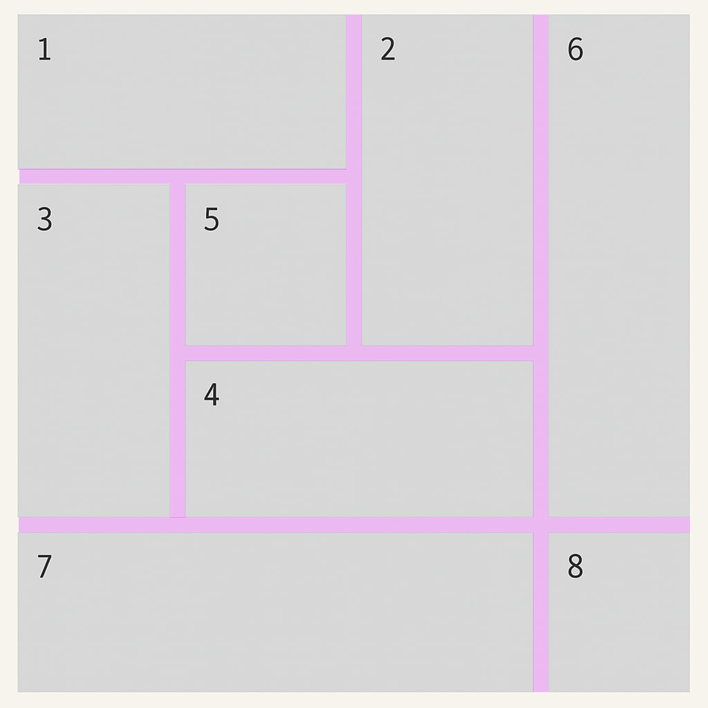
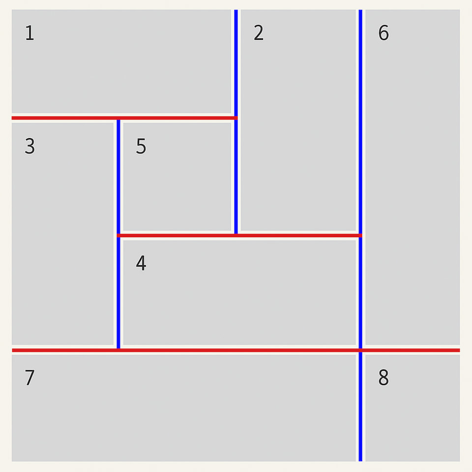
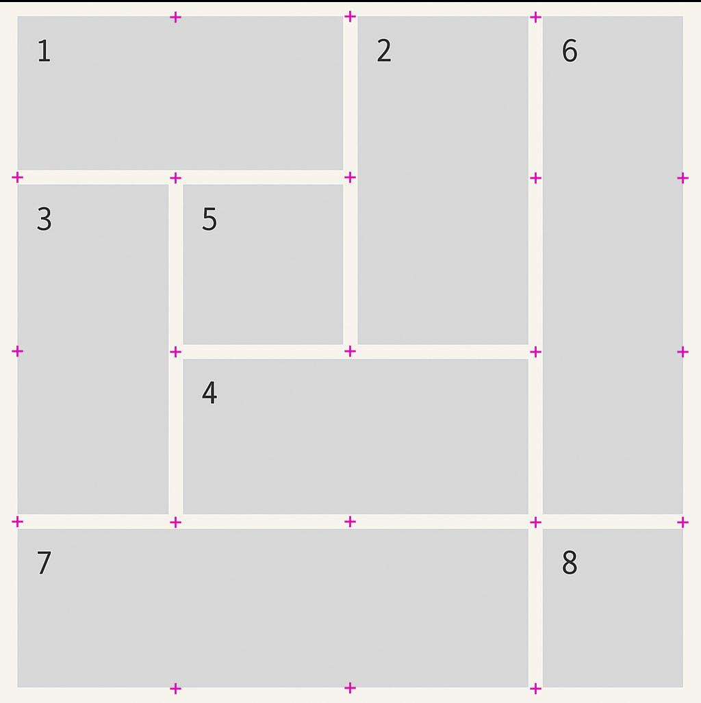
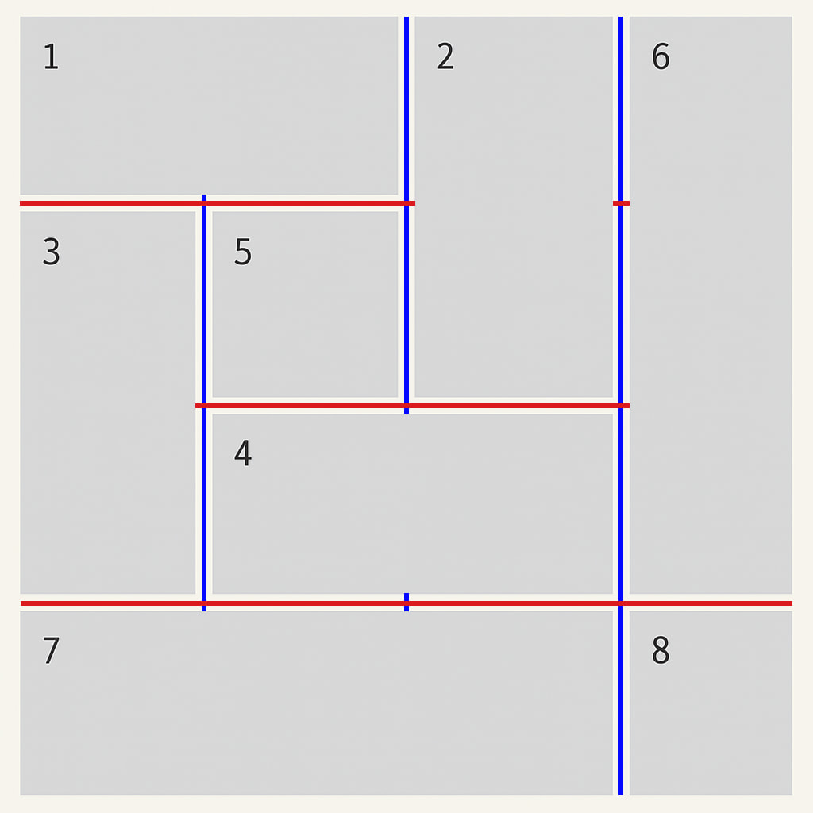
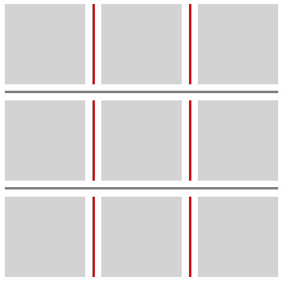
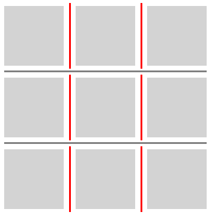
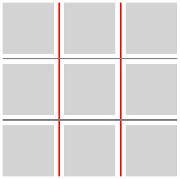
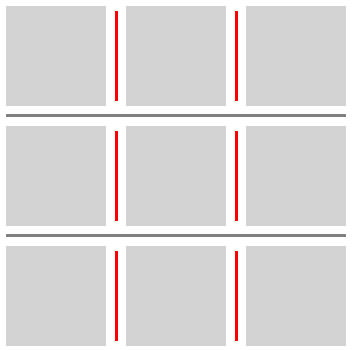
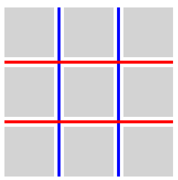

Сегодня мы с вами подробно разберём новую спецификацию CSS — [CSS Gap Decorations Module Level 1](https://www.w3.org/TR/2025/WD-css-gaps-1-20250417/), которая недавно была представлена W3C в статусе Draft.

Эта спецификация вводит новые возможности для оформления промежутков между строками и столбцами в гридах, флексах и мультиколонках.

## Что такое Gap Decorations?

Если вы работаете с флексами или гридами, то встречали свойства `gap`, `row-gap` и `column-gap`, которые задают расстояние между элементами внутри контейнера.

**Gap Decorations** — это развитие этих свойств, которое позволяет добавлять декоративные линии или другие элементы непосредственно в промежутки между строками и столбцами.



## Основные свойства Gap Decorations

Спецификация добавляет ряд новых CSS-свойств, основные из которых:
- `column-rule` и `row-rule` — задают оформление линий в промежутках между колонками и строками соответственно.
- `column-rule-color`, `column-rule-style`, `column-rule-width` и их аналоги для строк (`row-rule-color`, `row-rule-style`, `row-rule-width`) позволяют отдельно задавать цвет, стиль и толщину линий.

Пример использования:
```css
.grid-container {
  display: grid;
  gap: 20px;
  column-rule: 4px solid blue;
  row-rule: 4px dashed red;
}
```



## Как это работает: intersection points

Линии оформлений строятся относительно **точек пересечений промежутков** (gap intersection points). Это точки, которые возникают:
- на пересечении промежутка и края контейнера;
- на пересечении промежутков в разных направлениях.

Эти точки формируют сегменты, между которыми рисуются линии оформления.



## Управление разрывами линий: `rule-break`

Свойства `column-rule-break` и `row-rule-break` контролируют, в каких случаях линии прерываются или продолжаются.

Варианты значений:
- `none` — линии всегда продолжаются.
- `spanning-item` — линии прерываются при пересечении с элементами, занимающими несколько ячеек (spanning).
- `intersection` — линии прерываются на всех пересечениях.

### Значение `none`
```css
.break-none-grid {
  display: grid;
  grid-template: repeat(4, 100px) / repeat(4, 100px);
  gap: 20px;
  row-rule: 6px solid red;
  column-rule: 6px solid blue;
  rule-outset: 0px;

  rule-break: none;
}
```



### Значение `spanning-item`
```css
.break-none-grid {
  ...

  rule-break: spanning-item;
}
```


### Значение `intersection`
```css
.break-none-grid {
  ...

  rule-break: intersection;
}
```


## Настройка длины линий: `rule-outset`

Свойства `column-rule-outset` и `row-rule-outset` позволяют настроить длину линий относительно точек пересечения:

- Значение `50%` (по умолчанию) делает линии пересекающимися ровно в середине.
- Значение `0` делает линии ровно по границе элементов.
- Отрицательные значения сокращают линии, положительные — удлиняют.

### Примеры использования:
```css
.outset-0px {
  column-rule-outset: 0px;
  column-rule-break: intersection;
}
```



```css
.outset-5px {
  column-rule-outset: 5px;
  column-rule-break: intersection;
}
```



```css
.outset-50percent {
  column-rule-outset: 50%;
  column-rule-break: intersection;
}
```



```css
.outset-negative-5px {
  column-rule-outset: -5px;
  column-rule-break: intersection;
}
```



## Порядок отрисовки: rule-paint-order
Свойство `rule-paint-order` позволяет задавать порядок отрисовки линий:
- `row-over-column` — строки рисуются поверх колонок.
- `column-over-row` — колонки рисуются поверх строк.

### Примеры использования:
```css
.row-over-coulumn {
  rule-paint-order: row-over-column;
  row-rule: 6px solid red;
  column-rule: 6px solid blue;
}
```



```css
.grid-container {
  rule-paint-order: column-over-row;
  row-rule: 6px solid red;
  column-rule: 6px solid blue;

}
```


## Дополнительные свойства: `repeat()`
Новая нотация `repeat()` позволяет задать циклическое повторение значений цвета, ширины и стиля линий. Это удобно для создания чередующихся узоров.

Пример использования:
```css
.grid-container {
  /* без repeat() */
  column-rule-color: gray red blue red blue red blue gray;

  /* с repeat() */
  column-rule-color: gray repeat(3, red blue) gray;
}
```

## Би-направленные shorthand-свойства
Спецификация также вводит сокращённые свойства, которые одновременно задают параметры для **строк** и **столбцов**: `rule-color`, `rule-style`, `rule-width`, `rule`.

Пример использования:
```css
.grid-container {
  rule: 3px dashed green;
}
```

## Источники
- [CSS Gap Decorations Module Level 1](https://www.w3.org/TR/2025/WD-css-gaps-1-20250417/)
