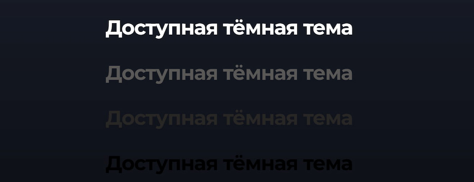
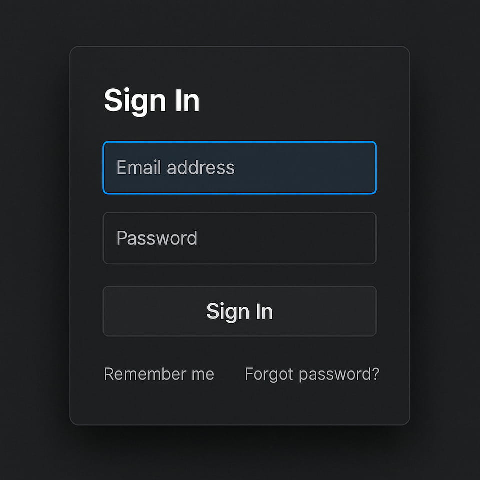
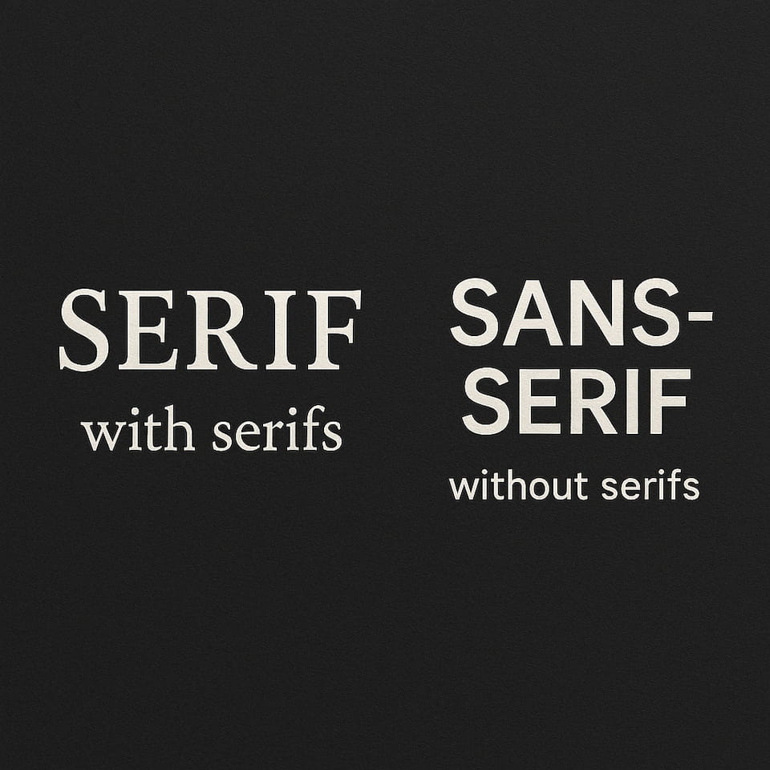
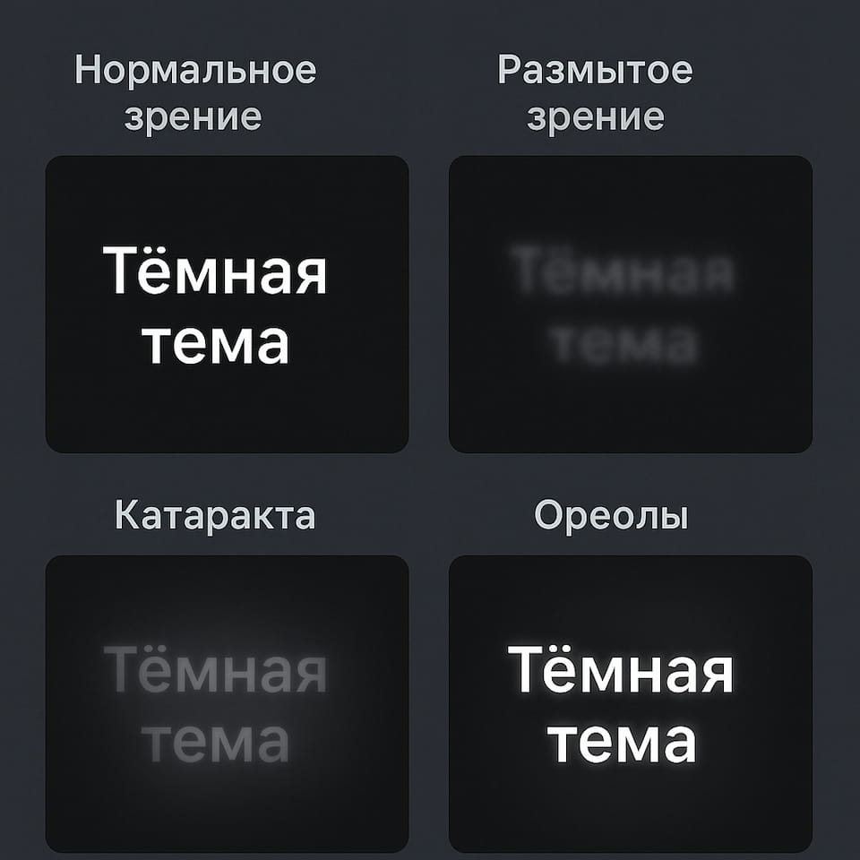

Как сделать тёмную тему действительно инклюзивной для всех пользователей? Многие считают тёмную тему стильной и удобной, ведь она снижает нагрузку на глаза и выглядит довольно современно. Но далеко не всегда при её создании учитываются потребности людей с различными зрительными особенностями. Давайте разбираться, как же правильно адаптировать тёмный режим, чтобы он был полезен всем без исключения.


## Плюсы и минусы темного режима с точки зрения доступности
Тёмный режим предоставляет ряд реальных преимуществ с точки зрения доступности, если он разработан грамотно. Например, люди с повышенной чувствительностью к свету могут ощутить заметное снижение нагрузки на глаза благодаря мягким тонам на фоне глубоких тёмных оттенков. Плюс это может быть полезно в условиях низкой освещённости, когда слишком яркие белые фоны утомляют.

Однако темная тема далеко не универсальное решение. У некоторых пользователей с астигматизмом или низкой контрастной чувствительностью могут возникать проблемы при чтении светлого текста на тёмном фоне. Может возникать так называемый эффект «ореола» вокруг букв, и текст начинает размываться, снижая скорость и комфорт чтения.

## Роль контраста в доступности темного режима
Контраст — ключ к тому, насколько легко будет пользоваться вашим сайтом или приложением в тёмном режиме. Если цвета подобраны неверно, пользователи просто не смогут различать элементы интерфейса и быстро устанут от чтения. С другой стороны, когда контраст продуман, это способствует более глубокому вовлечению и удерживает внимание.



Принципы минимально необходимого контраста описаны в руководстве [WCAG 2.1](https://www.w3.org/TR/WCAG22/#contrast-minimum) (раздел 1.4.3 Contrast (Minimum), уровень AA). Для интерфейсов, где требуется ещё более высокий уровень доступности, можно ориентироваться на уровень AAA (раздел 1.4.6 Contrast (Enhanced)).

## Пример CSS для обеспечения контраста
Ниже небольшой фрагмент CSS, показывающий, как можно использовать тёмный фон и светлый текст с достаточным контрастом (примерно 4.5:1 или выше).

```css
body {
  background-color: #121212; /* Тёмно-серый фон вместо абсолютного #000000 */
  color: #ffffff; /* Светлый текст */
  font-family: sans-serif;
}

/* Пример кнопки с достаточным контрастом относительно фона */
.button-dark-mode {
  background-color: #2c2c2c; /* Ещё один оттенок тёмно-серого */
  color: #ffffff;
  border: none;
  padding: 10px 20px;
  margin: 10px 0;
  border-radius: 4px;
  cursor: pointer;
  /* Это цветовое сочетание близко к требованиям WCAG 2.1 (1.4.3) */
}

.button-dark-mode:hover {
  background-color: #3f3f3f; /* Чуть более светлый фон для состояния hover */
}
```


<style>
.frame {
  background-color: #121212;
  color: #ffffff;
  font-family: sans-serif;
  display: flex;
  justify-content: center;
}


.button-dark-mode {
  background-color: #2c2c2c;
  color: #ffffff;
  border: none;
  padding: 10px 20px;
  margin: 10px 0;
  border-radius: 4px;
  cursor: pointer;
}

.button-dark-mode:hover {
  background-color: #3f3f3f;
}
</style>

<div class="frame">
  <button class="button-dark-mode" type="button">Кнопка</button>
</div>

Обратите внимание, что мы не используем чистый чёрный цвет, чтобы уменьшить нагрузку на глаза и смягчить контраст.

## Разработка контраста в тёмных темах
Чтобы сохранить хорошую читаемость, стоит использовать не абсолютно чёрный (#000000) фон, а более мягкие тёмно-серые оттенки (#121212, #1A1A1A и др.). Это уменьшит «резкость» перехода между фоном и текстом, сделает восприятие комфортнее.

Стоит учитывать и проблемы сглаживания шрифтов (anti-aliasing). На некоторых устройствах светлый текст на тёмном фоне может выглядеть с «сияющими» границами. Регулярное тестирование (особенно с участием людей с различными нарушениями зрения) и тонкая настройка CSS помогут избежать этих проблем.

## Важность читабельности в тёмных темах
Тёмные темы выглядят эстетично, но важно следить, чтобы функции интерфейса оставались понятными. Кнопки и поля ввода должны быть чётко заметны, чтобы пользователь не тратил время и силы на поиски.

Также не забывайте, что сейчас всё активнее используются автоматизация и машинное обучение. Если какой-то блок или кнопка сливается с фоном, это может мешать не только человеку, но и алгоритмам, которые обрабатывают страницу. Отсюда простой вывод: чем лучше структурирован и читабелен интерфейс, тем меньше проблем при дальнейшем развитии и масштабировании проекта.



## Лучшие стратегии для разработки доступных темных тем
1. Усиливайте контраст для удобства
   - Используйте более мягкие тона вместо чистого чёрного.
   - Ставьте акцент на важные элементы: кнопки и ссылки должны иметь контраст выше 4.5:1 (WCAG 2.1, 1.4.3 Contrast (Minimum)).
   - Тестируйте интерфейс в реальных условиях: при разном уровне освещения, на разных экранах.
2. Уделяйте особое внимание типографике
   - Sans-serif шрифты часто показывают себя с лучшей стороны, так как они легче читаются на контрастном фоне.
   - Выделяйте важные элементы: если это заголовок или призыв к действию, используйте чуть более светлый оттенок или более жирный шрифт, чтобы не потерять акцент.
   - Следите за размерами: слишком мелкий шрифт и тонкие линии быстро утомляют глаза.



```css
h1, h2, h3 {
  font-weight: 700; /* Более ярко выраженные заголовки */
  color: #f0f0f0;    /* Светлый оттенок на темном фоне */
}

p {
  line-height: 1.6;
  margin-bottom: 1.2em;
  color: #ececec;
  font-size: 1rem;
}

/* Мелкие элементы вроде подписей к картинкам или примечаний */
.small-text {
  font-size: 0.875rem;
  color: #b3b3b3; /* Чуть более тусклый цвет, но всё же контрастный относительно фона */
}
```

3. Продуманное использование цветов
   - При подборе цветовой палитры для тёмной темы учитывайте не только эстетику, но и потребности людей с цветовой слепотой (дальтонизм) или иными нарушениями зрения.
   - Избегайте слишком резких/кислотных оттенков — они могут «бить по глазам».
   - Используйте инструменты проверки контраста (например, [WebAIM Contrast Checker](https://webaim.org/resources/contrastchecker/) для контроля соответствия [WCAG](https://www.w3.org/TR/WCAG22/).

4. Понимание восприятия цвета и зрительных ограничений
   Существует множество различных зрительных нарушений: от катаракты и глаукомы до астигматизма. Универсального решения нет, но стремитесь охватить как можно шире.

   - Низкое зрение: используйте крупные шрифты, упрощённую верстку.
   - Светочувствительность: снижайте яркость светлых элементов.
   - Астигматизм: учитывайте опасность размывания текста.
   - Диабетическая ретинопатия: избегайте пёстрых элементов, делайте интерфейс лаконичным.



## Делайте темный режим выбором пользователя
Одни люди обожают тёмный режим, другие чувствуют в нём дискомфорт, третьи не придают ему значения. Позвольте пользователю самому выбирать, какой вариант ему подходит больше.
- Предоставьте удобный переключатель между светлой и тёмной темой.
- Позвольте тонко настраивать тёмную тему, менять яркость или оттенки.
- Автоматическое запоминание выбора: при повторном входе пользователь сразу увидит тему, которая ему удобнее.

### Пример JS-переключателя для тёмного / светлого режима
Ниже приведён простой пример, как можно дать пользователям выбрать тему с помощью JavaScript:

```html
<!DOCTYPE html>
<html lang="ru">
<head>
  <meta charset="UTF-8">
  <title>Dark/Light Toggle Example</title>
  <style>
    :root {
      --bg-color: #FFFFFF;
      --text-color: #000000;
    }

    [data-theme="dark"] {
      --bg-color: #121212;
      --text-color: #FFFFFF;
    }

    body {
      background-color: var(--bg-color);
      color: var(--text-color);
      transition: background-color 0.3s, color 0.3s;
      font-family: sans-serif;
      padding: 20px;
    }

    .theme-toggle {
      cursor: pointer;
      background-color: var(--text-color);
      color: var(--bg-color);
      border: none;
      padding: 10px 20px;
      border-radius: 4px;
      margin-bottom: 20px;
    }
  </style>
</head>
<body>
  <button class="theme-toggle" id="themeToggle">Toggle Theme</button>
  <p>Это пример переключения между светлой и тёмной темой.</p>

  <script>
    const toggleBtn = document.getElementById('themeToggle');
    toggleBtn.addEventListener('click', () => {
      if (document.documentElement.getAttribute('data-theme') === 'dark') {
        document.documentElement.removeAttribute('data-theme');
        localStorage.setItem('theme', 'light');
      } else {
        document.documentElement.setAttribute('data-theme', 'dark');
        localStorage.setItem('theme', 'dark');
      }
    });

    // Сохраняем предпочтения пользователя
    const savedTheme = localStorage.getItem('theme');
    if (savedTheme === 'dark') {
      document.documentElement.setAttribute('data-theme', 'dark');
    }
  </script>
</body>
</html>
```

- При клике на кнопку переключаем `data-theme` между `dark` и светлым режимом (по умолчанию).
- Используем `:root` для определения переменных CSS.
- Сохраняем выбор пользователя в localStorage, чтобы при обновлении страницы тема оставалась прежней.

## Источники
- [Success Criterion 1.4.3 Contrast (Minimum)](https://www.w3.org/TR/WCAG22/#contrast-minimum)
- [Success Criterion 1.4.6 Contrast (Enhanced)](https://www.w3.org/TR/WCAG22/#contrast-enhanced)
- [Inclusive Dark Mode: Designing Accessible Dark Themes For All Users](https://www.smashingmagazine.com/2025/04/inclusive-dark-mode-designing-accessible-dark-themes/)
