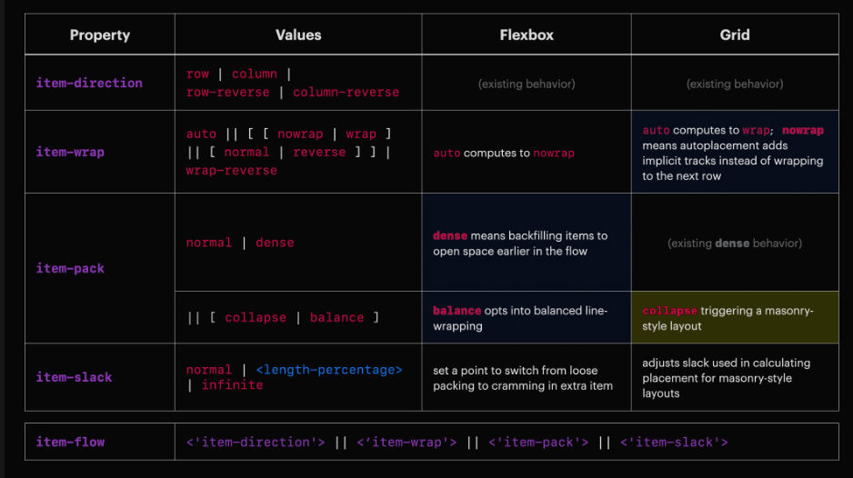
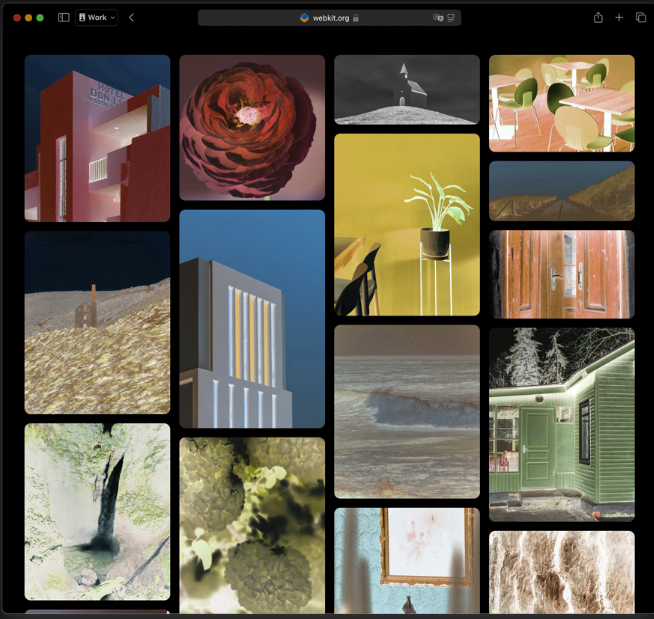

## Логическая связь между первой и второй частями
В первой части, опубликованной в апреле, мы рассмотрели, что такое ItemFlow и зачем объединять `flex-flow `и `grid-auto-flow` в один механизм. Если вы ещё не читали её, обязательно вернитесь к «[Item Flow: объединяем флексы, гриды и Masonry вединый инструмент](https://shabalin.online/blog/css/item-flow/)»
— там объясняется, откуда появился этот термин и почему CSS‑сообщество хочет заменить разрозненные свойства для разных моделей на единый набор. Вкратце напомню: идея ItemFlow состоит в том, чтобы определить общее направление размещения элементов, управление переносами, «упаковкой» и дополнительными настройками через набор новых свойств (item-direction, item-wrap, item-pack, item-slack), которые одинаково работают и во Flexbox, и в Grid, и в будущем Masonry. Такое объединение позволит флексам получить плотную упаковку, грядущим гриду — отключать перенос, а разработчикам — включать masonry‑раскладку без сторонних библиотек.

Спустя несколько месяцев в блоге WebKit вышла вторая статья, где авторы раскрыли, как ItemFlow может помочь реализовать нативную masonry‑раскладку и какие вопросы ещё остаются открытыми. Ниже — подробный разбор.

<figure>

  

  <figcaption>Изображение из статьи https://webkit.org/blog/17219/item-flow-part-2-next-steps-for-masonry/ </figcaption>
</figure>

## Как переключаться в masonry‑режим: отдельный `display` или `item-pack: collapse`?
Главный вопрос, который обсуждает сообщество: как браузер должен понимать, что контейнер должен раскладывать элементы по принципу masonry? Вариантов два:
- Новое значение `display`. Если считать masonry‑раскладку отдельным, автономным типом отображения (как `flex` или `grid`), то логично было бы ввести отдельный идентификатор `display:masonry`. Пример кода:
```css
.container {
  display: masonry;
  grid-template-columns: repeat(auto-fill, minmax(14rem, 1fr));
  gap: 1rem;
}
```
Такой подход делает masonry «особым» новым значением `display`, но усложняет экосистему: приходится учить ещё один новый тип.

- Использовать существующий `display: grid` + ItemFlow. Авторы WebKit предлагают считать masonry‑раскладку разновидностью Grid и не вводить новый `display`. В этом случае включение masonry происходит через новое значение свойства `item-pack`, которое будет означать «обрушить» строки (collapse) и сложить элементы подобно кирпичам. Код выглядит так:
```css
.container {
  display: grid;
  grid-template-columns: repeat(auto-fill, minmax(14rem, 1fr));
  item-flow: collapse;
  gap: 1rem;
}
```

Выбор между `display: masonry` и `display: grid` зависит от ментальной модели разработчика. Если считать masonry совершенно новой сущностью, тогда первый вариант логичен. Если же воспринимать masonry как частный случай Grid, то использование grid с дополнительной настройкой ItemFlow кажется естественным. WebKit называет оба подхода открытыми для обсуждения, но склоняется ко второму, аргументируя, что он объединяет синтаксис и уменьшает количество новых сущностей

## Что такое «ряд» в мире masonry?
Второй важный вопрос — как понимать значения `row` и `column` в контексте masonry‑раскладки. В традиционных флексах и гридах «ряд» (row) и «колонка» (column) означают одно и то же как для направления потока элементов, так и для визуального «рисунка» макета. Однако в masonry эти две концепции расходятся.

Авторы статьи предлагают рассмотреть два способа описания макета:
- «Поток элементов» (flow‑of‑items) — порядок, в котором браузер размещает элементы: слева направо, сверху вниз и т.д.
- «Форма макета» (shape‑of‑layout) — визуальный рисунок, который мы видим после размещения: чёткие ряды или чёткие колонки.

Для Flexbox обе перспективы совпадают: элементы обычно идут слева направо, затем переносятся вниз, и визуально мы видим именно строки. Независимо от того, описываем ли мы порядок потоков или форму макета, в большинстве случаев слово `row` применимо для обоих понятий.

В Grid ситуация сложнее: поток элементов идёт по строкам, но визуальный рисунок может зависеть от размеров и размещения элементов — иногда выделяются строки, иногда колонки. Поэтому выбор `row` или `column` как термина зависит от того, что разработчик считает главным. Для Grid по сути можно взять `row` как направление потока, но форма макета может меняться.

Для masonry‑раскладки два понятия расходятся ещё сильнее. Визуально мозг воспринимает раскладку по колонкам: мы видим несколько чётких вертикальных дорожек, а ряды кажутся «сломанными» и перепутанными. Однако поток элементов идёт по строкам: элементы размещаются слева направо, заполняя свободное место сверху и переходя к следующей строке, когда в текущей больше нет места. Именно этот перпендикулярный характер и создаёт знакомый «водопадный» эффект. Поэтому при описании masonry важно разделять направление потока и форму макета.

## Возможные имена свойств
Если рассматривать masonry как разновидность Grid, то для выбора направления лучше использовать `item-direction` (аналог `flex-direction`), описывающий именно поток элементов (`row` или `column`). В таком случае значение `item-direction: row` будет означать, что элементы размещаются слева направо с обрушением строк. А вторая часть (`item-pack: collapse`) задаёт поведение «обрушения» рядов. Вместе их можно записать кратко: `item-flow: row collapse` — так, как показано в примере ниже

<figure>



  <figcaption>Изображение из статьи https://webkit.org/blog/17219/item-flow-part-2-next-steps-for-masonry/ </figcaption>
</figure>

Если же описывать masonry как отдельный тип макета, то полезно ввести свойство, отражающее форму: например, `item-track: column`, чтобы указать, что визуально важны колонки, а не строки. Пока это всего лишь обсуждаемые варианты;

## Пример реализации masonry с помощью ItemFlow
Как будет выглядеть классический пример masonry‑раскладки с использованием ItemFlow? Предположим, вы хотите создать «водопад» из карточек шириной 14rem, которые упаковываются в несколько колонок с равным интервалом. Код может выглядеть так:

```css
.container {
  display: grid;
  grid-template-columns: repeat(auto-fill, minmax(14rem, 1fr));
  item-flow: row collapse; /* направление потока и включение masonry */
  gap: 1rem;
}
```

В этом примере `display: grid` определяет контейнер как грид, `grid-template-columns` задаёт количество и размер колонок, а `item-flow: row collapse` включает плотную упаковку по строкам. По сути это тот же Grid, который вы привыкли использовать, только с дополнительной командой «обрушить» ряды. В статье подчёркивается, что синтаксис намеренно знаком разработчикам: использовать стандартные правила грида и добавить лишь одно новое свойство.

Если же вы хотите создать masonry‑раскладку в обратном направлении (когда поток идёт по колонкам, а обрушиваются колонки), код будет похож, но с другими значениями:
```css
.container {
  display: grid;
  grid-template-rows: repeat(auto-fill, minmax(8lh, 1fr));
  item-flow: column collapse; /* элементы идут сверху вниз, колонки обрушаются */
  gap: 1rem;
}
```
Эти примеры демонстрируют мощь ItemFlow: универсальные свойства позволяют переключать направления и включать masonry‑режим как в «прямом», так и в «перпендикулярном» варианте без дополнительных библиотек и хака с отрицательными маргинами.

## Почему WebKit склоняется к grid + ItemFlow

Авторы WebKit объясняют, что, по их мнению, masonry‑раскладка — это вариант Grid, а не самостоятельный тип. Такой подход даёт несколько преимуществ:
- **Снижение порога входа**. Разработчики уже знакомы с Grid: они задают размеры и количество дорожек с помощью `grid-template-columns/rows`. Добавить к этому одно новое свойство проще, чем изучать новый тип `display`.
- **Единая терминология**. Использование `item-direction` и `item-pack` перекликается с привычными свойствами `flex-direction` и `flex-wrap`, что делает понятнее, что происходит. Выбор «ряд vs колонка» для ItemFlow согласован с поведением flex‑контейнеров, что может снизить количество ошибок.
- **Расширяемость**. Если в будущем появятся новые вариации плотной раскладки или дополнительные режимы, их проще будет описать через новые значения item-pack и item-direction, чем вводить новые типы display.

Тем не менее, вопрос ещё открыт: CSS Working Group обсуждает оба варианта и приглашает разработчиков выразить своё мнение.

## Источники
- [Item Flow – Part 2: next steps for Masonry](https://webkit.org/blog/17219/item-flow-part-2-next-steps-for-masonry/)
