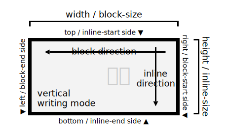

Привет! Это статья для общего понимания логических свойств в CSS, без глубокого разбора.

## Что такое логические свойства?

Представь, что ты пишешь текст на бумаге. В зависимости от языка, текст может идти слева направо (как в русском или английском) или справа налево (как в арабском). Логические свойства в CSS учитывают это направление текста и автоматически адаптируются под него.

### Концепция Block и Inline направлений

В CSS логические свойства основаны на двух основных направлениях:
- **Inline** - направление, в котором течёт текст (горизонтально в большинстве языков)
- **Block** - направление, перпендикулярное потоку текста (вертикально в большинстве языков)

Вместо использования жёстко заданных координат (верх, низ, лево, право), которые не учитывают направление письма, мы используем логические понятия:

- `inline-start` - начало строки (слева в LTR, справа в RTL)
- `inline-end` - конец строки (справа в LTR, слева в RTL)
- `block-start` - начало блока (обычно сверху)
- `block-end` - конец блока (обычно снизу)


*Направление в английском языке*


*Направление в китайском языке*


## Основные логические свойства

Вместо привычных `margin-left` и `margin-right` мы используем:

```css
.element {
  margin-inline-start: 20px;  /* Слева для LTR, справа для RTL */
  margin-inline-end: 20px;    /* Справа для LTR, слева для RTL */
}
```

Вместо `margin-top` и `margin-bottom`:

```css
.element {
  margin-block-start: 20px;   /* Сверху */
  margin-block-end: 20px;     /* Снизу */
}
```

## Логические свойства для border

Для границ тоже есть логические свойства. Вместо привычных `border-left` и `border-right`:

```css
.element {
  border-inline-start: 2px solid black;  /* Слева для LTR, справа для RTL */
  border-inline-end: 2px solid black;    /* Справа для LTR, слева для RTL */
}
```

И вместо `border-top` и `border-bottom`:

```css
.element {
  border-block-start: 2px solid black;   /* Сверху */
  border-block-end: 2px solid black;     /* Снизу */
}
```

Также доступны логические свойства для отдельных характеристик границы:

```css
.element {
  /* Для толщины границы */
  border-inline-start-width: 2px;
  border-block-start-width: 2px;

  /* Для стиля границы */
  border-inline-start-style: solid;
  border-block-start-style: solid;

  /* Для цвета границы */
  border-inline-start-color: black;
  border-block-start-color: black;
}
```

## Логические свойства для размеров

Для размеров элемента тоже есть логические аналоги:

```css
.element {
  /* Вместо width */
  inline-size: 200px;

  /* Вместо height */
  block-size: 100px;

  /* Вместо min-width и max-width */
  min-inline-size: 100px;
  max-inline-size: 300px;

  /* Вместо min-height и max-height */
  min-block-size: 50px;
  max-block-size: 150px;
}
```

## Почему это важно?

1. **Поддержка разных языков**: Твой сайт будет корректно отображаться на любом языке без дополнительных правок.
2. **Меньше кода**: Не нужно писать отдельные стили для RTL-версий.
3. **Современный подход**: Это часть современного CSS, который делает вёрстку более гибкой.
4. **Международные сайты**: Если ты создаёшь сайт на нескольких языках, включая языки с направлением RTL, логические свойства значительно упростят твою работу.
5. **Адаптация к разным системам письма**: Помимо направления LTR и RTL, логические свойства помогут с вертикальными системами письма, как в японском или китайском языках.

## Практический пример

Давай посмотрим на реальный пример:

```css
.card {
  /* Старый подход */
  margin-left: 20px;
  margin-right: 20px;
  padding-top: 15px;
  padding-bottom: 15px;

  /* Новый подход с логическими свойствами */
  margin-inline: 20px;
  padding-block: 15px;
}
```

но больше всего мне нравится современный вариант центровщика:

```css
.card {
  /* Старый подход */
  margin: 0 auto;

  /* То что мне на самом деле нужно,
  но вариант избыточный  */
  margin-left: auto;
  margin-right: auto;

  /* Новый подход с логическими свойствами */
  margin-inline: auto;
}
```

В старом подходе меня всегда смущало набирать `0`. Он мне не нужен, но набивать его раз за разом приходится, так как это требование. По сути мне нужен второй вариант, когда я явно указываю, что нужны "автотические" отступы слева и справа. С современным вариантом меня начало абсолютно всё устравивать. `0` отвалился сам собой и ушла избыточность.


## Сокращения

CSS предоставляет удобные сокращения:

```css
.element {
  /* Вместо margin-inline-start и margin-inline-end */
  margin-inline: 20px;

  /* Вместо padding-block-start и padding-block-end */
  padding-block: 20px;

  /* Для всех сторон */
  inset: 20px;  /* Вместо top, right, bottom, left */
}
```

Также доступны сокращения для границ:

```css
.element {
  /* Все inline границы (лево и право в LTR) */
  border-inline: 1px solid black;

  /* Все block границы (верх и низ) */
  border-block: 1px solid black;
}
```

## Поддержка браузеров

Хорошая новость! Логические свойства поддерживаются всеми современными браузерами. Браузеры начали широко поддерживать эти свойства с 2021 года.

Для поддержки старых браузеров можно использовать fallback:

```css
.element {
  margin-left: 20px;  /* Fallback */
  margin-inline-start: 20px;  /* Современное решение */
}
```

естестенно руками такое писать не нужно, так как с этим прекрасно справляется автоматизаци.

## Практические советы

1. Начни использовать логические свойства в новых проектах
2. При рефакторинге старых проектов постепенно переходи на логические свойства
3. Используй сокращения для более чистого кода
4. Не забывай про fallback для старых браузеров
5. Обязательно тестируй свой сайт в режимах LTR и RTL, чтобы убедиться в корректной работе логических свойств

## Реальное применение

Представь, что ты разрабатываешь многоязычный интернет-магазин. На арабской версии сайта все элементы должны "зеркально" отображаться:

```css
/* Старый подход */
.product-image {
  float: left;
  margin-right: 20px;
}

[dir="rtl"] .product-image {
  float: right;
  margin-left: 20px;
  margin-right: 0;
}

/* Новый подход с логическими свойствами */
.product-image {
  float: inline-start;
  margin-inline-end: 20px;
}
```

С логическими свойствами тебе не нужно писать отдельные правила для RTL - всё работает автоматически!

## Типичные ошибки начинающих

Когда только начинаешь использовать логические свойства, легко попасть в несколько распространенных ловушек:

1. **Смешивание физических и логических свойств**:
   ```css
   /* Неправильно */
   .box {
     margin-left: 10px;
     margin-inline-end: 20px;
   }
   ```
   Проблема: в LTR режиме `margin-inline-end` соответствует правому полю, что конфликтует с `margin-left`.

2. **Забывание о режиме направления**:
   ```css
   /* Недостаточно */
   html {
     direction: rtl;
   }
   ```
   Для корректной работы логических свойств важно установить атрибут `dir` или CSS-свойство `direction`.

3. **Невнимательность к списку свойств с префиксом `border-`**:
   Многие разработчики забывают, что для границы есть не только основные свойства, но и свойства для цвета, стиля и ширины.
