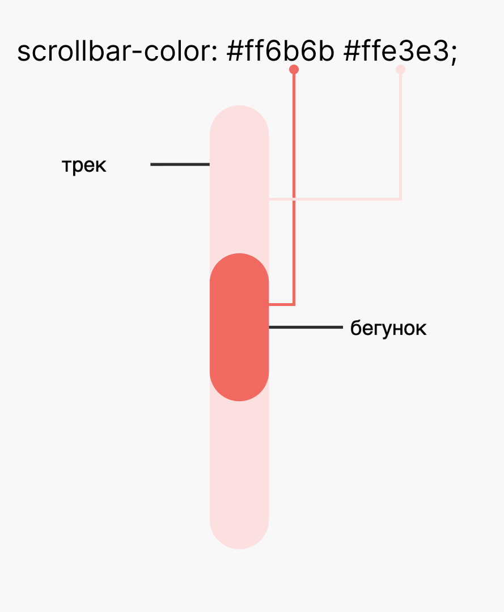

<style>
  html {
    scrollbar-color: rebeccapurple orange;
  }
</style>

Полосы прокрутки — это неотъемлемая часть взаимодействия с веб-страницей, особенно в современном мире, где контент часто динамически подгружается, а интерфейсы становятся сложнее. Долгое время разработчики были ограничены в возможностях их стилизации. На смену хаков с JavaScript и плагинам пришёл стандартизированный подход — спецификация **[CSS Scrollbars Styling Module Level 1](https://www.w3.org/TR/css-scrollbars-1/)**.

## CSS Scrollbars Styling Module Level 1
**CSS Scrollbars Styling Module Level 1** — находится на стадии «Кандидата в рекомендации». Это означает, что спецификация стабильна, прошла широкое обсуждение и готова к внедрению в браузеры.

**Основная цель** модуля — предоставить веб-разработчикам простой и стандартизированный способ влиять на визуальное оформление полос прокрутки. Спецификация определяет два ключевых аспекта:
1.  **Цвет** полосы прокрутки: бегунка и трека
2.  **Толщину** (ширину) полосы прокрутки.
<figure class="scrollbar-parts-diagram">
<div class="diagram-canvas" aria-hidden="true">
  <div class="track"></div>
  <div class="thumb"></div>

  <div class="label-track">трек</div>
  <div class="line-track"></div>

  <div class="label-thumb">бегунок</div>
  <div class="line-thumb"></div>

  <div class="width-bracket">
    <span class="cap left"></span>
    <span class="line"></span>
    <span class="cap right"></span>
  </div>
  <div class="width-label">ширина трека</div>
</div>
  <figcaption>
    Иллюстрация кастомных частей скролбара: трек (полоса) и бегунок
  </figcaption>
</figure>

<style>
.scrollbar-parts-diagram {
  display: flex;
  flex-direction: column;
  align-items: center;
  width: 100%;
}

.scrollbar-parts-diagram .diagram-canvas {
  position: relative;
  width: 260px;
  height: 470px;
  background: #f8f8f8;
  border-radius: 8px;
  font-family: sans-serif;
}

.scrollbar-parts-diagram .track {
  position: absolute;
  top: 40px;
  left: 110px;
  width: 40px;
  height: 320px;
  border-radius: 20px;
  background: #ffd6de;
}

.scrollbar-parts-diagram .thumb {
  position: absolute;
  top: 150px;
  left: 115px;
  width: 30px;
  height: 100px;
  border-radius: 20px;
  background: #ff8fa3;
}

.scrollbar-parts-diagram .label-track,
.scrollbar-parts-diagram .label-thumb,
.scrollbar-parts-diagram .width-label {
  position: absolute;
  color: #333;
  font-size: 14px;
}

.scrollbar-parts-diagram .label-track {
  top: 74px;
  left: 20px;
}

.scrollbar-parts-diagram .line-track,
.scrollbar-parts-diagram .line-thumb {
  position: absolute;
  height: 2px;
  background: #333;
}

.scrollbar-parts-diagram .line-track {
  top: 80px;
  left: 80px;
  width: 30px;
}

.scrollbar-parts-diagram .label-thumb {
  top: 194px;
  left: 195px;
}

.scrollbar-parts-diagram .line-thumb {
  top: 200px;
  left: 150px;
  width: 40px;
}

.scrollbar-parts-diagram .width-bracket {
  position: absolute;
  top: 372px;
  left: 110px;
  width: 40px;
  height: 16px;
}

.scrollbar-parts-diagram .width-bracket .line {
  position: absolute;
  top: 8px;
  left: 0;
  width: 40px;
  height: 2px;
  background: #333;
}

.scrollbar-parts-diagram .width-bracket .cap {
  position: absolute;
  top: 0;
  width: 2px;
  height: 16px;
  background: #333;
}

.scrollbar-parts-diagram .width-bracket .cap.left {
  left: 0;
}

.scrollbar-parts-diagram .width-bracket .cap.right {
  right: 0;
}

.scrollbar-parts-diagram .width-label {
  top: 398px;
  left: 88px;
}

.scrollbar-parts-diagram figcaption {
  margin-top: 1em;
  text-align: center;
}
</style>

Важно понимать, что эта спецификация занимается именно *внешним видом* самого элемента управления (`scrollbar`), а не тем, *как* контент прокручивается или располагается на странице. За логику прокрутки отвечает модуль **[CSS Overflow Module](https://www.w3.org/TR/css-overflow-3/)**.

### Почему это важно? (Область применения)
До появления этого модуля стилизация скроллбаров была возможна только через нестандартные псевдоэлементы (`::-webkit-scrollbar`), которые работали лишь в браузерах на движке WebKit (Safari, старые версии Chrome/Edge) и официально считаются ошибкой (mistake) со стороны рабочей группы CSS. Новый подход решает три основные задачи:

1.  **Брендирование и эстетика:** Позволяет подобрать цвет скроллбара под цветовую схему веб-приложения, делая интерфейс целостным.
2.  **Экономия пространства:** Даёт возможность сделать скроллбар тоньше (`thin`) в небольших областях прокрутки, где важна экономия места.
3.  **Создание кастомных интерфейсов:** Позволяет полностью скрыть стандартный скроллбар (`none`), чтобы на его месте реализовать свою уникальную логику прокрутки, не затрагивая при этом саму возможность прокручивать контент. Повторюсь, спецификация отвечает только за внешний вид, а не функциональность.

### Что НЕ входит в задачи спецификации ([Out Of Scope](https://www.w3.org/TR/css-scrollbars-1/#out-of-scope))
Создатели спецификации намеренно отказались от излишней детализации. Вы не сможете управлять внутренним устройством скроллбара, например, стилизовать стрелки или фон кнопок по отдельности. Это сделано намеренно, так как структура скроллбаров сильно различается в разных операционных системах (Windows, macOS, Linux). Попытка задать жесткую структуру привела бы к тому, что на одних платформах дизайн выглядел бы идеально, а на других — сломался.

## Основные свойства спецификации
Спецификация вводит два основных CSS-свойства: `scrollbar-color` и `scrollbar-width`. Оба свойства применяются к **scroll containers** (элементам, которые могут прокручиваться, например, с `overflow: auto` или `overflow: scroll`).


### 1. Управление цветом: `scrollbar-color`
Свойство `scrollbar-color` позволяет задать цвета для двух основных частей полосы прокрутки:
*   **Thumb (бегунок):** Движущаяся часть, которую пользователь перетаскивает.
*   **Track (трек):** Фон или дорожка, по которой движется бегунок.

**Синтаксис:**
```css
scrollbar-color: auto | <цвет-бегунка> <цвет-трека>;
```

**Значения:**
*   `auto` (по умолчанию): Браузер сам определяет цвета, следуя настройкам операционной системы или страницы (например, учитывая `color-scheme`).
*   `<цвет> <цвет>`: Первое значение задаёт цвет бегунка, второе — цвет трека.



**Важные замечания:**
*   Свойство **наследуется** (inherited: yes). Если задать цвет для `<body>`, он применится ко всем скроллбарам на странице, если только не будет переопределён позже.
*   Если свойство задано для корневого элемента `<html>`, оно применяется к скроллбару всего окна просмотра (viewport). При этом, в отличие от `overflow`, значения с `<body>` на вьюпорт **не распространяются**.
*   Браузеры могут игнорировать цвета, если на платформе нет соответствующих частей скроллбара, или упростить его отрисовку, чтобы иметь возможность применить цвета.

#### Пример использования `scrollbar-color`
Создадим простую карточку с большим объёмом текста и стилизуем её скроллбар.

**HTML:**
```html
<article class="card">
  <h2>Карточка товара</h2>
  <p>Lorem ipsum dolor sit amet, consectetur adipiscing elit. ... (очень много текста) ...</p>
  <p>...</p>
</article>

```

**CSS:**
```css
.card {
  scrollbar-color: #ff6b6b #ffe3e3;
  /* Бегунок будет красноватым, трек — светло-розовым */
}
```

Начните скролить внутри блока "длинный текст" (ниже), чтобы увидеть красноватый бегунок. Чтобы увидеть розовый трек, в некоторых операционных системах нужно навести курсор на бегунок. Нужно успеть сделать это до того, как бегунок скроется.
Но иногда поведение зависит от конкретного браузера. В Сафари на macOS мне не удалось увидеть трек.

<figure class="demo-1">
  <div class="card">
    <h2>Длинный текст</h2>
    <p>Lorem ipsum dolor sit amet, consectetur adipiscing elit. ... (очень много текста) ...</p>
    <p>...</p>
  </div>
  <figcaption>Стилизованный скроллбар с помощью свойства <code>scrollbar-color</code></figcaption>
</figure>

<style>
.demo-1 {
  display: flex;
  flex-direction: column;
  justify-content: center;
  align-items: center;
}

.demo-1 .card {
    width: 300px;
    height: 200px;
    overflow-y: auto;
    padding: 10px;
    border: 1px solid #ccc;
    font-family: sans-serif;
    background-color: #f9f9f9;

    /* Стилизуем скроллбар */
    scrollbar-color: #ff6b6b #ffe3e3;
    /* Бегунок будет красноватым, трек — светло-розовым */
}

/* Для наглядности сделаем контент длиннее */
.demo-1 .card p {
  margin-bottom: 10px;
  line-height: 1.6;
}
</style>


**Результат:**
В браузерах, поддерживающих спецификацию (Firefox, новые версии Chrome/Edge), вы увидите, что бегунок стал красноватым, а дорожка — светло-розовой

### 2. Управление толщиной: `scrollbar-width`
Свойство `scrollbar-width` позволяет контролировать, насколько толстым будет скроллбар.

**Синтаксис:**
```css
scrollbar-width: auto | thin | none;
```

**Значения:**
*   `auto` (по умолчанию): Стандартная ширина скроллбара, предусмотренная операционной системой или настройками пользователя.
*   `thin`: Более тонкая версия скроллбара. Браузер должен предоставить скроллбар тоньше обычного, но при этом сохранить его удобство для взаимодействия. Если платформа не позволяет сделать скроллбар тоньше (например, он и так минимален), значение может работать как `auto`.
*   `none`: Полностью скрывает скроллбар. **Важно:** при этом элемент *остаётся прокручиваемым* (например, с помощью колёсика мыши, клавиатуры или тачпада). Используйте это значение с осторожностью, так как оно может сделать контент недоступным для пользователей, которые полагаются только на мышь.


<figure class="scrollbar-width-diagram">
<div class="diagram-canvas" aria-hidden="true">
  <div class="track"></div>

  <div class="label-track">трек</div>
  <div class="line-track"></div>

  <div class="width-bracket">
    <span class="cap left"></span>
    <span class="line"></span>
    <span class="cap right"></span>
  </div>
</div>
  <figcaption>
    Показывает ширину трека
  </figcaption>
</figure>

<style>
.scrollbar-width-diagram {
  display: flex;
  flex-direction: column;
  align-items: center;
  width: 100%;
}

.scrollbar-width-diagram .diagram-canvas {
  position: relative;
  width: 260px;
  height: 420px;
  background: #f8f8f8;
  border-radius: 8px;
  font-family: sans-serif;
}

.scrollbar-width-diagram .track {
  position: absolute;
  top: 60px;
  left: 120px;
  width: 24px;
  height: 300px;
  border-radius: 12px;
  background: #ffe3e3;
}

.scrollbar-width-diagram .label-track {
  position: absolute;
  top: 94px;
  left: 30px;
  color: #333;
  font-size: 14px;
}

.scrollbar-width-diagram .line-track {
  position: absolute;
  top: 100px;
  left: 90px;
  width: 30px;
  height: 2px;
  background: #333;
}

.scrollbar-width-diagram .width-bracket {
  position: absolute;
  top: 372px;
  left: 120px;
  width: 24px;
  height: 16px;
}

.scrollbar-width-diagram .width-bracket .line {
  position: absolute;
  top: 8px;
  left: 0;
  width: 24px;
  height: 2px;
  background: #333;
}

.scrollbar-width-diagram .width-bracket .cap {
  position: absolute;
  top: 0;
  width: 2px;
  height: 16px;
  background: #333;
}

.scrollbar-width-diagram .width-bracket .cap.left {
  left: 0;
}

.scrollbar-width-diagram .width-bracket .cap.right {
  right: 0;
}

.scrollbar-width-diagram figcaption {
  margin-top: 1em;
  text-align: center;
}
</style>


**Важные замечания:**
*   Свойство **не наследуется** (inherited: no).
*   Основная цель `thin` — не эстетика, а решение проблемы нехватки места в "тесных" интерфейсах.
*   Значение `none` — это мощный инструмент для создания кастомных скроллбаров на JavaScript. Вы скрываете стандартный, а поверх рисуете свой. При этом браузерная логика прокрутки продолжает работать.
*   Как и в случае с цветом, значение для корневого элемента `<html>` применяется к вьюпорту, а с `<body>` — нет.

#### Пример использования `scrollbar-width`
Модифицируем наш предыдущий пример. Допустим, карточка очень маленькая, и стандартный скроллбар "съедает" много драгоценного места.

**CSS (дополнение к предыдущему примеру):**
```css
.card {
    /* ... все предыдущие стили ... */
    scrollbar-color: #ff6b6b #ffe3e3;
    scrollbar-width: thin; /* Делаем скроллбар тоньше */
}
```

В некоторых браузерах и операционных системах `thin` и `auto` могут отличаться незначительно, так что разница практически неощутима, но на самом деле она есть.

<figure class="demo-2">
  <div class="card" style="scrollbar-width: auto;">
    <h2>Длинный текст</h2>
    <p>Lorem ipsum dolor sit amet, consectetur adipiscing elit. ... (очень много текста) ...</p>
    <p>...</p>
  </div>
  <div class="card">
    <h2>Длинный текст</h2>
    <p>Lorem ipsum dolor sit amet, consectetur adipiscing elit. ... (очень много текста) ...</p>
    <p>...</p>
  </div>
  <figcaption>Слева(или сверху на мобильном) <code>scrollbar-width: auto</code>. Уменьшенный скроллбар с помощью свойства <code>scrollbar-width: thin</code> справа(или снизу на мобильном).  </figcaption>
</figure>

<style>
.demo-2 {
  display: flex;
  flex-wrap: wrap;
  gap: 20px;
  justify-content: center;
  align-items: center;
}

.demo-2 .card {
    width: 300px;
    height: 200px;
    overflow-y: auto;
    padding: 10px;
    border: 1px solid #ccc;
    font-family: sans-serif;
    background-color: #f9f9f9;

    /* Стилизуем скроллбар */
    scrollbar-color: #ff6b6b #ffe3e3;
    scrollbar-width: thin; /* Делаем скроллбар тоньше */
}

/* Для наглядности сделаем контент длиннее */
.demo-2 .card p {
  margin-bottom: 10px;
  line-height: 1.6;
}

.demo-2 figcaption {
  width: 100%;
}
</style>

**Результат:**
Полоса прокрутки станет уже. Пользователь по-прежнему может ей пользоваться, но места она занимает меньше.

#### Пример использования `scrollbar-width: none`
Рассмотрим другой сценарий: мы хотим полностью скрыть стандартный скроллбар, но оставить возможность прокрутки.

**CSS (дополнение к предыдущему примеру):**
```css
.card {
    /* ... все предыдущие стили ... */
    scrollbar-color: #ff6b6b #ffe3e3;
    scrollbar-width: none; /* Полностью скрываем скроллбар */
}
```

Прокрутка останется рабочей (колёсико мыши, тачпад, клавиатура), но визуального индикатора скролла не будет.

<figure class="demo-3">
  <div class="card no-scrollbar">
    <h2>Длинный текст</h2>
    <p>Lorem ipsum dolor sit amet, consectetur adipiscing elit. ... (очень много текста) ...</p>
    <p>...</p>
  </div>
  <figcaption>Скрытый скроллбар с помощью свойства <code>scrollbar-width: none</code></figcaption>
</figure>

<style>
.demo-3 {
  display: flex;
  flex-direction: column;
  justify-content: center;
  align-items: center;
}

.demo-3 .card {
    width: 300px;
    height: 200px;
    overflow-y: auto;
    padding: 10px;
    border: 1px solid #ccc;
    font-family: sans-serif;
    background-color: #f9f9f9;
}

.demo-3 .no-scrollbar {
    scrollbar-width: none; /* Полностью скрываем скроллбар */
}

/* Для наглядности сделаем контент длиннее */
.demo-3 .card p {
  margin-bottom: 10px;
  line-height: 1.6;
}
</style>

**Результат:**
Скроллбар визуально исчезнет, но прокрутка контента сохранится. Используйте такой приём осторожно и обязательно добавляйте другие визуальные подсказки о наличии прокрутки.

## Доступность (Accessibility) и лучшие практики
Спецификация уделяет большое внимание доступности:

1.  **Контрастность:** При задании пользовательских цветов с помощью `scrollbar-color` автор должен убедиться, что между цветом бегунка и трека достаточно контраста (согласно [WCAG 2.1 SC 1.4.11](https://dequeuniversity.com/resources/wcag2.1/1.4.11-non-text-contrast)). Пользовательские настройки могут отключать эти требования.
2.  **Тонкие скроллбары:** Используя `scrollbar-width: thin`, убедитесь, что скроллбар остаётся достаточно широким, чтобы по нему можно было легко попасть курсором. WCAG 2.1 рекомендует минимальный размер цели 44x44 CSS-пикселя. Браузеры могут динамически увеличивать тонкий скроллбар при наведении.
3.  **Осторожность с `none`:** Никогда не скрывайте скроллбар (`scrollbar-width: none`), если это единственный способ для пользователя обнаружить, что контент прокручивается. Всегда предоставляйте альтернативные визуальные подсказки.
4.  **Уважение к пользователю:** Пользователи могут настроить предпочтительный стиль скроллбаров в своей ОС или браузере (например, всегда показывать широкие скроллбары). В спецификации сказано, что браузеры могут игнорировать значение `thin`, если пользователь указал, что ему некомфортно с тонкими скроллбарами.

## Поддержка браузерами
Оба CSS-свойства, `scrollbar-color` и `scrollbar-width`, имеют статус Newly available в инициативе Baseline, причём с разницей в год.

Статус Widely available для `scrollbar-color` ожидается [12 июня 2028 года](https://nikolai-shabalin.github.io/css-baseline-timeline/?property=scrollbar-color), а для `scrollbar-width` — [11 июня 2027 года](https://nikolai-shabalin.github.io/css-baseline-timeline/?property=scrollbar-width).

На данный момент различия в работе очевидны: в Safari поведение отличается.
