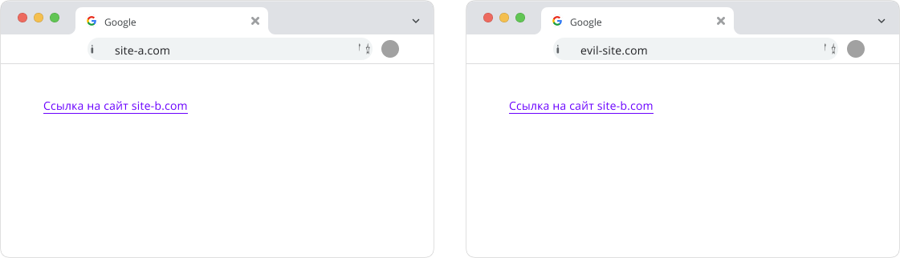
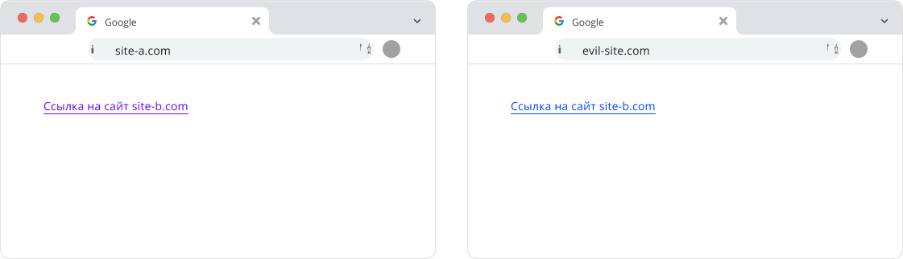

Представь, что на странице есть набор ссылок, и при клике на любую из них цвет меняется на фиолетовый. За это поведение в CSS отвечает псевдокласс `:visited`. Мы так привыкли к этому механизму, что многие даже не задумываются, какие проблемы с безопасностью могут в нём скрываться. Давай разберёмся по порядку.

## Как работает `:visited`
С самого начала существования интернета веб-сайты полагались на селектор `:visited`, чтобы стилизовать ссылки, которые пользователь уже посещал. Это помогает улучшить юзабилити: пользователю проще отличать посещённые ссылки от тех, на которых он ещё не был.

Однако со временем исследователи нашли способы с помощью` :visited` «вытягивать» из браузера данные о том, какие ссылки нажимал пользователь. Такие атаки позволяли (и до сих пор позволяют во многих случаях) определять историю просмотров. Более того, разработчики браузеров уже давно пытаются это чинить, но всё равно полностью искоренить такие утечки было непросто.

С выходом Chrome 136 появился принципиально новый подход: разделение истории (`:visited `link partitioning), который практически делает все старые методы атаки бесполезными.

## Проблема отсутствия разделения
Чтобы стилизовать ссылки как посещённые, браузер хранит список адресов, по которым пользователь уже кликнул. Если браузер не разделяет такую историю, то любая страница, на которой отображена ссылка на уже когда-то посещённый адрес, сможет «вычислить» факт твоего посещения.



**Пример:**
1. Ты зашёл на сайт `site-a.com` и кликнул на ссылку, ведущую на `site-b.com`.
2. Затем открыл «злонамеренный» сайт `site-evil.com`, у которого тоже есть ссылка на `site-b.com`.
3. Без разделения истории браузер увидит, что `site-b.com` уже посещён, и применит к нему стили `:visited`.
4. «Злой» сайт с помощью определённых ухищрений может обнаружить, что ссылка именно стилизована как посещённая, и понять, что ты бывал на `site-b.com`.

## Что такое «разделение» (partitioning) истории?
В Chrome 136 и выше поведение меняется. Теперь в браузере учитывается, где конкретно пользователь кликнул на ссылку. И если ты нажал ссылку на одном сайте, то на другом она не будет выделяться фиолетовым — так как, грубо говоря, «разрешение» на стилизацию фиксируется за конкретным контекстом.

Иными словами, когда ты кликаешь по ссылке на `site-a.com`, эта информация сохраняется в браузере как пара:

```
(Top-level site) + (Ссылка-назначение)
```

Поэтому, если ты зайдёшь на любой другой сайт, он больше не сможет вывести ту же ссылку как посещённую, потому что в записи нет совпадения контекста.



## Исключение: ссылки внутри одного и того же сайта
Допустим, ты сидишь на `site.wiki`, читаешь статью про «chrome», а потом кликаешь на ссылку про «brass», и это тоже страница внутри `site.wiki`. При строгом разделении она бы не отобразилась как посещённая на других страницах внутри `site.wiki`, так как «точка входа» была только на странице про «chrome». Но, поскольку сам сайт `site.wiki` и так может узнать, что ты читал различные его страницы (например, по логам или кукам), браузер позволяет автоматически считать все внутренние ссылки в пределах одного домена «посещёнными» без дополнительных условий.

Таким образом, ссылки внутри одного и того же сайта всё равно могут отображаться как посещённые, чтобы не портить тебе удобство серфинга. А вот ссылки на другие домены или в третьесторонних `iframe` уже теряют эту «привилегию».

## Источники
- [Making :visited more private](https://developer.chrome.com/blog/visited-links)
