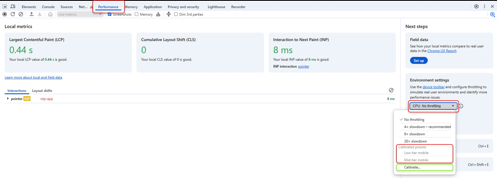
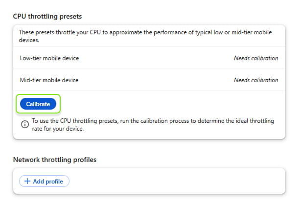
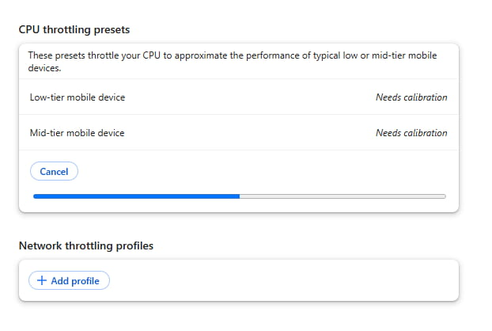
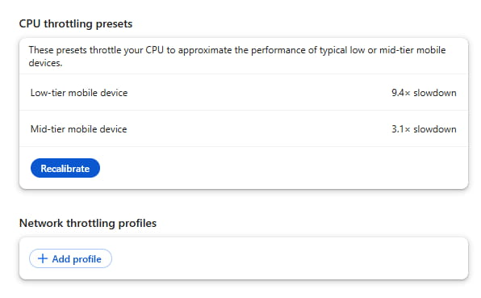

## Почему важно учитывать реальные данные
Вы, как разработчики, наверняка сталкивались с тем, что ваше рабочее окружение (быстрый ноутбук или мощный десктоп) не всегда отражает опыт пользователей, которые заходят на сайт с гораздо более слабых мобильных устройств. В результате может получиться так, что на вашем компьютере всё летает, а у реальных пользователей — тормозит.

DevTools давно позволяет включать троттлинг CPU — это удобно, когда нужно быстро отлаживать проблемы, которые проявляются только на медленных мобильных устройствах. Но всегда оставался вопрос: **какое именно “X-раз” замедление выбрать**? 4x? 20x? Неочевидно, насколько эти цифры соответствуют реальным устройствам посетителей сайта. И к тому же мощность рабочей машины у каждого своя.

### Калибровка CPU-троттлинга: убираем догадки

Начиная с Chrome 134, DevTools предлагает функцию **CPU throttling calibration** — небольшую утилиту, которая подскажет, какой уровень троттлинга будет эквивалентен «среднему» или «слабому» мобильному устройству именно для вашего компьютера.

 **Как это работает?**

- При первом открытии вкладки **Performance** в секции _Environment settings_ на выпадающем списке троттлинга будут неактивны два пункта: «low-tier mobile» и «mid-tier mobile». Чуть ниже вы найдёте вариант **Calibrate…**.

    

- Нажимаете на него, затем на кнопку «Calibrate», а далее «Continue», подтверждаете, что страница может кратковременно перезагрузиться,

    

- и DevTools запускает небольшой бенчмарк.

    

- По завершении вы получите две готовые настройки троттлинга, «low-tier» и «mid-tier», которые соответствуют слабым и средним мобильным устройствам — именно относительно производительности **вашего** компьютера.

    

В большинстве случаев, если вы хотите эмулировать **типичный** смартфон, достаточно выбрать «mid-tier mobile». Если проблемы в основном у пользователей со старенькими устройствами, переключайтесь на «low-tier mobile». При желании вы можете повторно пройти процесс калибровки — например, если обновили компьютер, или что-то пошло не так при первом замере.

## Как DevTools замедляет CPU
Вам, возможно, интересно: «Как вообще реализован CPU-троттлинг?» На самом деле логика простая. Когда вы включаете замедление, Chrome запускает специальный поток, который время от времени прерывает главный поток страницы. В итоге реальный процессор работает быстро, но вкладка «видит» доступное время CPU лишь в долях секунды — именно столько, сколько нужно, чтобы «ощущать» заданный уровень X-раз замедления.

К примеру, при троттлинге 4x главный поток «спит» примерно 75% времени, чтобы каждая задача занимала в четыре раза дольше. То есть DevTools не вносит специальные правки для JS, layout и так далее; весь цикл браузера замедляется в целом, поскольку главный поток фактически «замораживается» большую часть времени.

## Когда троттлинг приближен к реальному телефону…
Многие задачи, нагружающие мобильный CPU, будут похожи при использовании троттлинга. Представьте, что пользователь нажимает кнопку, мы добавляем несколько элементов в DOM, потом идёт перерасчёт стилей и верстки. На десктопе это может занять, скажем, 67 мс. Если включить «mid-tier mobile», то та же операция может затянуться примерно до 200–210 мс. То есть вы явно видите, как задача превращается в «долгую», и можете диагностировать проблемы.

Проверка того же самого действия на реальном среднем мобильном устройстве покажет близкое по форме и длительности выполнение, скажем, около 190 мс. Для CPU-нагруженных операций такого рода калибровка работает очень даже хорошо.

## …а когда тесты на настоящем устройстве всё ещё необходимы

Однако не забывайте, что троттлинг не покрывает **все** аспекты мобильного железа. Например:

1.  **Работа с диском**. На телефоне он медленнее, чем у вас на SSD, да и шина памяти уже.
2.  **Тепловое ограничение** (thermal throttling). Телефон может сбросить тактовую частоту из-за перегрева.
3.  **Графические особенности**. DevTools-троттлинг воздействует в основном на главный поток. Но тяжелая GPU-обработка (всякие box-shadow, blur, сложные анимации) на десктопе может быть быстрой, а мобильная графика окажется в два-три раза медленнее.

Допустим, у вас есть большое количество `box-shadow` и фильтров при добавлении DOM-элементов. На десктопе, даже с троттлингом, главная часть задержки может прийтись на Paint, но GPU у ноутбука справится довольно шустро. На реальном смартфоне этот же блок будет отрисовываться ощутимо дольше. При этом вы увидите огромный след GPU-нагрузки в профиле, который не эмулировался на десктопе в нужном объёме.

То же самое касается глубоких сценариев загрузки страниц со множеством зависимостей, где есть игра с сетевым троттлингом, кэшами, межпроцессорными взаимодействиями и так далее. Если вы замечаете, что в полевых данных производительность низкая, а в лабораторных условиях на десктопе всё выглядит хорошо, обязательно проверьте реальное мобильное устройство.

## Источники
- [More accurate DevTools performance debugging using real-world data](https://developer.chrome.com/blog/devtools-grounded-real-world?hl=en)
