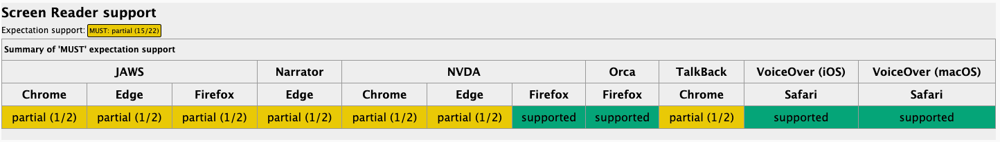

В спецификацию HTML5 добавили два новых атрибута `headingoffset` и `headingreset` — https://html.spec.whatwg.org/multipage/sections.html#heading-levels-&-offsets. [Issue](https://github.com/whatwg/html/issues/5033). [PR](https://github.com/whatwg/html/pull/11086)

Коротко:
- `headingoffset` — задаёт смещение уровня заголовков внутри элемента, увеличивая их вычисленный уровень на указанное число.
- `headingreset` — останавливает наследование headingoffset от внешних предков, позволяя начать вычисление уровней заголовков заново.

А теперь к проблеме...

### Какую проблему решают новые атрибуты
Судя по спецификации, видно, что W3C учитывает современные подходы к разработке, а именно [компонентный подход](/blog/longrid/component-driven-development/).

Давайте себе представим обычную ситуацию. Вы разработали компонент, в котором есть заголовок:

```html
<!-- компонент карточки -->
<article class="card">
  <h2>Новости браузеров</h2>
  <p>Что нового появилось в веб-платформе.</p>
</article>
```

Вам, конечно, может повезти, и вы правильно добавите компонент в подходящее место:

```html
<h1>Дайджест фронтенд-новостей</h1>

<article class="card">
  <h2>Новости браузеров</h2>
  <p>Что нового появилось в веб-платформе.</p>
</article>
```

Но чаще всего мы даже не задумываемся, в каком родителе окажется компонент. Нужно смотреть на сгенерированный HTML после сборки, запускать валидатор HTML и уже тогда понять, что уровень вложенности неправильный:

```html
<h1>Новости фронтенда</h1>

<section>
  <h2>Веб-платформа</h2>

  <!-- компонент карточки -->
  <article class="card">
    <!-- уже нужно h3 -->
    <h2>Новости браузеров</h2>
    <p>Что нового появилось в веб-платформе.</p>
  </article>
</section>
```

Самым простым вариантом, конечно же, является создать в компоненте пропс:

```html
<Card headingLevel={3} />
```

чтобы сменить уровень заголовка на нужный. Это ручной контроль со стороны внимательного разработчика, который следит за вложенностью заголовков.

W3C решила нам помочь (хотя это мы ещё поймём дальше в статье), добавив `headingoffset`. W3C вводит новое понятие — "вычисленный уровень заголовка" (computed heading level). Атрибут увеличивает вычисленный уровень всех заголовков, например:

```html
<article headingoffset="1">
  <h1>Новости браузеров</h1>
</article>
```

в DOM будет находиться `<h1>`, но его вычисленный уровень становится равным 2:
`h1 + headingoffset="1" = heading level 2`

Теперь наш вымышленный компонент можно подправить:

```html
<h1>Новости фронтенда</h1>

<section>
  <h2>Веб-платформа</h2>

  <!-- компонент карточки -->
  <article class="card" headingoffset="1">
    <!-- вычисленный уровень h3:
    h2 + headingoffset="1" = heading level 3 -->
    <h2>Новости браузеров</h2> <!-- в DOM останется h2 -->
    <p>Что нового появилось в веб-платформе.</p>
  </article>
</section>
```

Это всё ещё ручной труд для внимательного разработчика, который заметит проблему вложенности заголовков и добавит `headingoffset=""` с нужным повышением уровня. Да, и пропс `<Card headingLevel={3} />` продолжает стабильно работать. Давайте продолжать разбираться.

### Поднятие уровня ~в одиночку~ нескольких заголовков
В компоненте может быть несколько заголовков, например:

```html
<article>
  <h1>Новый CSS</h1>
  <h2>Комментарии</h2>
</article>
```

Если сфокусироваться на компоненте, то вложенность сейчас правильная (не смотрите на конкретные уровни), но если компонент поместить в непредвиденного родителя:

```html
<h1>Главная страница</h1>       → level 1
<h2>Последние публикации</h2>   → level 2

<article headingoffset="2">
  <h1>Новый CSS</h1>            → level 3
  <h2>Комментарии</h2>          → level 4
</article>
```

то придётся резко повышать уровень всех заголовков внутри. `headingoffset` с этой задачей как раз справляется просто отлично. Если изначально вложенность правильная, то поднятие на два уровня работает хорошо.

На этом примере становится понятно, что в компоненте вашего любимого фреймворка лучше передавать не уровень заголовка

```html
<Card headingLevel={3} />
```

и менять тег с `<h1>` на `<h3>`, а в случае, если заголовков в компоненте несколько, то делать несколько пропсов или как-то внутри компонента разруливать повышения для следующего заголовка — `headingLevel++`. Тут лучше передать `headingoffset`, так как его можно повесить на родителя, и все заголовки внутри правильно повысят свой уровень:

```html
<Card headingoffset={3} />
```

и не трогать теги. Этому пропсу по умолчанию можно передать `0`, тогда вычисленный уровень заголовка не будет изменён.

Такс, ну хорошо, уровни изменять стало чуть-чуть удобнее, но это всё также ручной труд, да ещё и не без проблем...

### Проблемы и нюансы
#### Складывание уровней
Мы пока всё ещё живём в мире, где не всегда понятно, какой компонент в какой вставлен. И если несколько компонентов со своим `headingoffset` будут вставлены друг в друга, то что произойдёт?

```html
<article headingoffset="1">
  <section headingoffset="2">
    <!-- какой вычисленный уровень у h2? -->
    <h2>Заголовок</h2>
  </section>
</article>
```

А произойдёт складывание уровней:

```
исходный h2 → 2
article → +1
section → +2

итого → 5
```

h2 в итоге станет h5. В таком случае получается, что вкладывание компонентов друг в друга лишь только повышает контроль над ними, а не уменьшает и нужно следить ещё пристальнее.


### Сверх нормы
Другой нюанс, который нужно учитывать при вычислении уровней, — это то, что их будет больше, чем h6. Давайте посмотрим на пример.

```html
<div headingoffset="8">
  <h2>Очень глубокий заголовок</h2>
</div>
```

Получаем в этом случае `2 + 8 = 10`. 10 уровень заголовка? Но такого же не существует.

По спецификации максимальный уровень, который можно передать в `headingoffset`, — это 9. У вычисленного уровня заголовка максимальный уровень — 9. То есть в нашем примере `2 + 8 = 10` итогом будет `9`.


Что в этом случае будут делать скринридеры? JAWS в Firefox вообще не отображает уровни выше 6, вместо этого возвращается к второму уровню. Тут ещё вскрывается другая проблема: старые версии скринридеров не будут знать `headingoffset`, и для них будет каша из вложенности, хотя по HTML5 стандарту и браузерной поддержке может быть всё нормально.

## Сбрасываем уровни
Все нюансы и проблемы, конечно же, можно решить. Зорким глазом и валидатором. Но как не дать уровням повыситься, если блок вложен в `headingoffset`? Для этого есть `headingreset` — булев атрибут, который отключает наследование повышения уровней заголовков:
```html
<h1>Главная страница</h1> <!-- level 1 -->
<h2>Последние публикации</h2> <!-- level 2 -->

<article headingoffset="2">
  <h1>Новый CSS</h1>
  <!-- level 3 -->
  <h2>Комментарии</h2>
  <!-- level 4 -->
  <aside headingreset>
    <h2>Полезные ссылки</h2> <!-- level 2 -->
    <section>
      <h3>Документация</h3> <!-- level 3 -->
    </section>
    <section>
      <h3>Примеры</h3>
      <!-- level 3 -->
    </section>
  </aside>
</article>
```

У блока `<aside>` уже есть правильная внутренняя структура:

```
h2 Полезные ссылки
├── h3 Документация
└── h3 Примеры
```

Но из-за `headingoffset="2"` у родительской статьи без `headingreset` она превратилась бы в:

```
h2 → level 4
h3 → level 5
```

`headingreset` останавливает влияние внешнего `headingoffset`, поэтому самостоятельный блок сохраняет свои исходные уровни:

```
h2 → level 2
h3 → level 3
```

## Что насчёт `aria-level`
В спецификации он тоже упоминается. Поддержка `aria-level` уже сейчас неплохая.



Но проблема с ним ровно такая же, как с передачей уровней в компонент. Для каждого уровня заголовка нужно передавать свой `aria-level`:

```html
<h1 aria-level="3">Заголовок</h1>
<h2 aria-level="4">Подзаголовок</h2>
```

`headingoffset` работает через родителя и меняет уровни у всех заголовков внутри элемента:

```html
<div headingoffset="2">
  <h1>Заголовок</h1> <!-- h3 -->
  <h2 >Подзаголовок</h2> <!-- h4 -->
</div>
```
