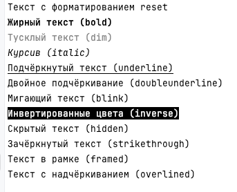
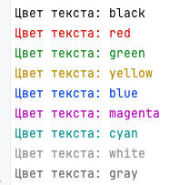
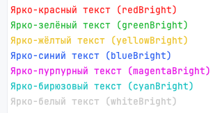
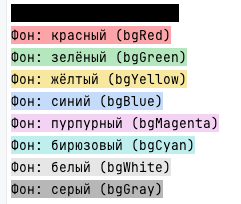
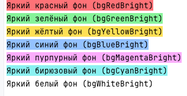

Сегодня разберём, как обойтись без `chalk`, `colors`, `picocolors` и прочего «цветного зоопарка» и при этом получить аккуратный, читаемый вывод в терминале.

В версиях Node v21.0–v21.3 `console.error()` автоматически выводил текст красным, а `console.warn()` — жёлтым:

```js
console.error('Фатальная ошибка!'); // 🔴 красный текст
console.warn('Возможная проблема.'); // 🟡 жёлтый текст
```

Однако в ответ на жалобы сообщества это поведение в v21.4 убрали, вернув совместимость со старыми LTS-ветками. Отсюда совет не полагайся на автоматическую раскраску — лучше делать её явно.

С версии v21.7.0 в ядро добавили API `util.styleText()`, и с его помощью можно выводить любой цвет без сторонних зависимостей:

```js
import { styleText } from 'node:util';

console.log(styleText('magenta', 'Привет, мир!')); // фиолетовый текст
console.log(styleText('bgGreen', 'Успех!')); // зелёный фон
console.log(styleText('redBright', '🔥 Срочно чиним!')); // ярко-красный
```

Весь список значений всегда можно проверить в [официальной документации](https://nodejs.org/api/util.html#modifiers)

**Сброс и оформление текста**

`reset`, `bold`, `dim`, `italic`, `underline`, `doubleunderline`, `blink`, `inverse`, `hidden`, `strikethrough`, `framed`, `overlined`



**Нейтральные цвета (foreground)**

`black`, `red`, `green`, `yellow`, `blue`, `magenta`, `cyan`, `white`, `gray`



**Яркие цвета (foreground Bright)**

`redBright`, `greenBright`, `yellowBright`, `blueBright`, `magentaBright`, `cyanBright`, `whiteBright`



**Фоновые цвета (background)**

`bgBlack`, `bgRed`, `bgGreen`, `bgYellow`, `bgBlue`, `bgMagenta`, `bgCyan`, `bgWhite`, `bgGray`



**Яркие фоновые цвета (background Bright)**

`bgRedBright`, `bgGreenBright`, `bgYellowBright`, `bgBlueBright`, `bgMagentaBright`, `bgCyanBright`, `bgWhiteBright`



## Заготовка для использования в проекте
Чтобы не дублировать код цвета, можно завести мини-палитру и единый метод логирования:

```js
import { styleText } from 'node:util';

const palette = {
  info:  'cyan',
  warn:  'yellow',
  error: 'redBright',
};

function log(level, message) {
  const color = palette[level] ?? 'white';
  console.log(styleText(color, `[${level.toUpperCase()}] ${message}`));
}

log('info',  'Собираем проект…');
log('warn',  'Используется устаревший API');
log('error', 'Билд упал!');

```
## Источники
- [Dependency-free Command-Line Apps powered by Node.js core modules](https://lirantal.com/blog/dependency-free-command-line-apps-powered-by-node-js-core-modules)

- [Node.js documentation](https://nodejs.org/api/util.html#modifiers)
