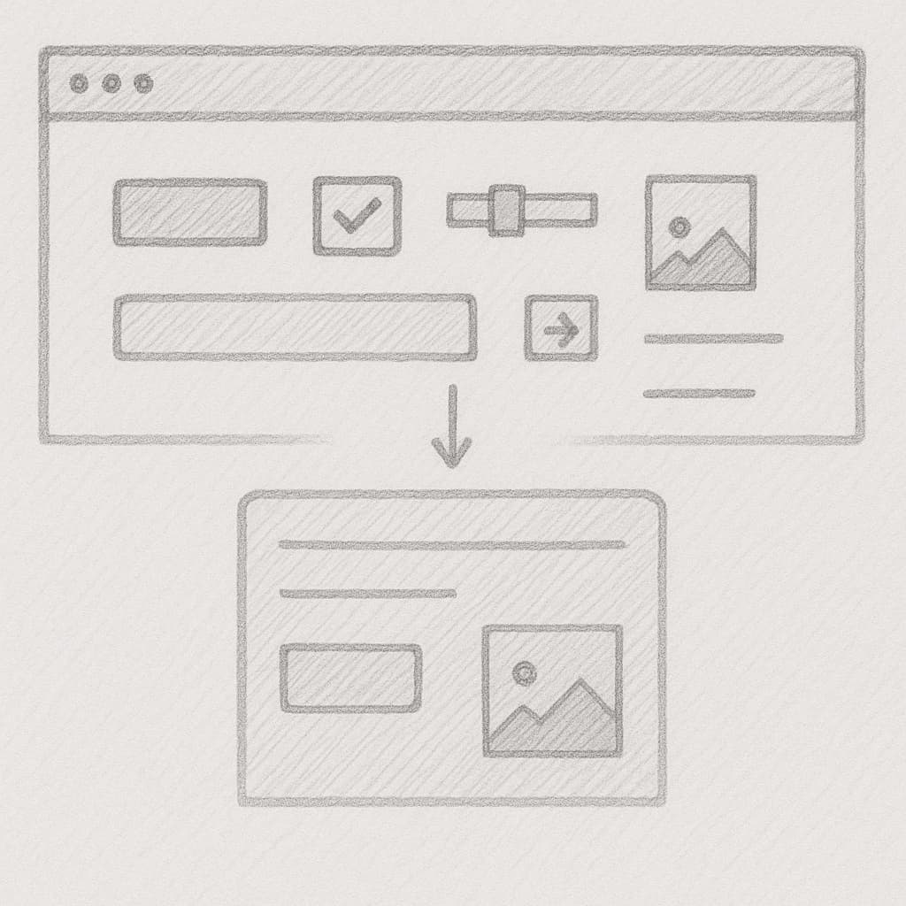
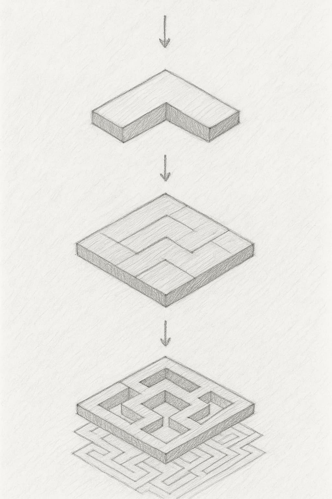

При компонентном подходе интерфейс собирается «снизу вверх»: сначала создаются самые простые, мелкие компоненты, затем из них формируются более крупные блоки, и в итоге складывается целая страница. Каждый компонент — это атомарный элемент, который полностью инкапсулирует логику, представление и стили своей области ответственности.



## Нам становится всё сложнее
Ещё десять–пятнадцать лет назад веб-разработку нередко «тащил» один фулл-стек-специалист: тот же человек проектировал базу данных, писал серверный код, верстал страницы и деплоил весь сайт целиком.

Сегодня всё устроено иначе. Команды разбиты на «узкие» роли — бэкендеры, фронтендеры, DevOps-инженеры, дизайнеры, аналитики — и каждый глубоко погружён в собственную доменную область. Парадоксально, но с появлением профильных экспертов интерфейсы не упростились, а напротив — усложнились: современный UI стал многослойным, насыщен бизнес-логикой и должен быть одинаково отзывчивым на сотне разных устройств, начиная от мобильных заканчивая телевизорами.

Чтобы не утонуть в этой сложности, фронтенд перешёл на компонентный подход. Компоненты стараются делать как можно более малыми и изолированными: каждый инкапсулирует собственную логику, шаблон и стили. Уже из такого «набора кирпичиков» строятся виджеты, секции и, в конечном счёте, целые приложения — гибкие, масштабируемые и удобные для командной работы.

## Компонент — капсула знаний и ответственности
У разных команд могут быть собственные соглашения о структуре проекта, но принцип остаётся общим: компонент обязан хранить всё, что нужно для его понимания, использования и развития. Такая «капсула» упрощает навигацию по коду, снижает связанность между модулями и ускоряет поддержку.

```bash
src/
  components/
    Button/
      ├── Button.test.tsx          # Тесты компонента
      ├── Button.stories.tsx       # Сторис для Storybook
      ├── Button.css               # Стили
      ├── Button.utils.ts          # Утилитарные функции, специфичные для Button
      ├── Button.tsx               # Компонент или шаблон
      ├── Button.types.ts          # Типы и интерфейсы (TypeScript)
      ├── index.ts                 # Экспорт компонента
      └── README.md                # Документация, краткое описание, примеры использования и API
```

- **Локализация знаний**. Любой разработчик, впервые открывший папку Button, видит полный набор артефактов: от типов и стилей до тестов и документации.
- **Простая эволюция**. Изменение поведения или внешнего вида компонента не расползается по проекту — достаточно работать в одной папке.
- **Удобство повторного использования**. Чёткое API и независимые зависимости позволяют легко переносить компонент в другие проекты или делиться им через пакетный менеджер.

## Стройте интерфейсы снизу вверх


1. Создай компонент
2. Объедини компоненты
3. Собери страницу
4. Создай проект

## Преимущества компонентного подхода
- **Качество интерфейса**. Создавая компоненты изолированно и описывая каждое возможное состояние, мы гарантируем, что UI корректно работает в самых разных сценариях — от нестандартных данных до крайних размеров экрана.
- **Надёжность кода**. Тесты на уровне компонентов ловят ошибки на раннем этапе и глубже, чем проверки целых экранов: меньше усилий — выше точность. Тесты для компонента гораздо проще создавать и поддерживать, чем для целого интерфейса.
- **Скорость разработки**. Вместо того чтобы «клепать» однотипные элементы заново, мы переиспользуем готовые компоненты из дизайн-системы и получаем новые интерфейсы быстрее.
- **Командная эффективность**. Разбивая UI на независимые блоки, мы можем параллельно распределить задачи между разработчиками и дизайнерами, избегая узких мест и ускоряя выпуск фич.
