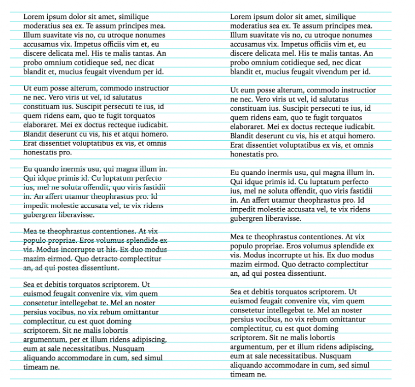

Веб-вёрстка уже давно позволяет строить впечатляющие макеты, но именно мелкие детали, часто самые трудоёмкие, выводят дизайн на новый уровень. К счастью, современный CSS оброс небольшими, но мощными инструментами, делающими тонкую шлифовку несравненно проще. Один из таких инструментов — единица `lh`.

## Что такое `lh` и `rlh`
С 2023 года все браузеры поддерживают две новые относительные единицы: `lh` и `rlh`.
- `1lh` — высота одной строки текущего шрифта при заданном `line-height`.
- `1rlh` — то же, но относительно корневого элемента, как `rem` по отношению к `em`.

Привязывая размеры к строчному интервалу, легко настроить чистый вертикальный ритм. Возьмём самый распространённый пример — отступы абзацев:

```css
p {
  margin-block: 1lh;
}
```

Если наложить тонкую сетку с шагом в `line-height`, станет очевидно, что при `1lh` каждый пустой интервал точно совпадает с шагом сетки, а при `1em`, изображение слева, — чуть «съезжает». Такой сдвиг портит ритм и создаёт ощущение хаоса, особенно в длинном тексте.



## Где работает `lh`
`lh` работает везде, где ждут числовое значение:
- `padding`, `gap`, `inset`, `height`, `width` — любой размер можно синхронизировать с ритмом текста.
- Комбинации `lh + ch` или `ex` открывают тонкую настройку как по вертикали, так и по горизонтали.


`lh` и `rlh` уже работают более чем в [94% актуальных браузеров](https://caniuse.com/mdn-css_types_length_rlh). Для оставшихся достаточно простого fallback-а:

```css
article {
  padding: 1em; /* видят старые браузеры */
  padding: 1lh; /* видят современные */
}
```

Старые движки рендерят привычные `1em`, а новые ровные `1lh`. Руками писать фолбэки не нужно. Отдайте эту работу роботам.

## Как посмотреть на вертикальный ритм

Если есть желание визуализировать вертикальный ритм, можно использовать класс:

```css
.horizontal-stripes {
  background-image: repeating-linear-gradient(
    rgba(0, 188, 212, 0.5) 0,
    rgba(0, 188, 212, 0.5) 1px,
    transparent 1px,
    transparent 1rlh
  );
}
```
