## Введение
Привет! Сегодня создадим собственный4 npm-пакет. Мы создадим инструмент командной строки под названием `cli-lorem`, который будет выводить текст lorem ipsum — стандартный заполнитель, используемый в дизайне и верстке. Ты научишься создавать проект, писать код, настраивать запуск из терминала и публиковать пакет на npm, чтобы другие могли его использовать. И всё это без сторонних библиотек, чтобы ты понял основы!

Наша цель — чтобы ты мог запустить команду вроде `cli-lorem -n 100` и получить 100 символов текста lorem ipsum.

## Что такое npm?
`npm` (Node Package Manager) — это менеджер пакетов для JavaScript, который позволяет управлять зависимостями и делиться кодом. Публикуя npm-пакет, ты делаешь свой код доступным для других разработчиков через реестр `npm` ([npmjs.com](https://www.npmjs.com)). Это как библиотека, где ты можешь взять чужой код или поделиться своим.

## Что такое CLI-инструмент?
CLI (Command Line Interface) — это программа, которая запускается из терминала. Например, когда ты вводишь `npm install`, ты используешь CLI-инструмент npm. Наш `cli-lorem` будет таким же: ты сможешь ввести `cli-lorem -n 100`, и он выведет текст нужной длины.

## Подготовка к работе
Прежде чем начать, убедись, что у тебя установлен Node.js и npm. Ты можешь проверить это, выполнив в терминале:

```bash
node -v
npm -v
```

Если они не установлены, скачай и установи Node.js с [официального сайта](https://nodejs.org).

> Всегда используй LTS(long-term support)-версию!

Также тебе понадобится уникальное имя для пакета. Проверь на [npmjs.com](https://www.npmjs.com), не занято ли имя `cli-lorem`. Если оно занято, используй область видимости, например `@yourusername/cli-lorem`, где `yourusername` — твое имя пользователя на npm.

## Настройка проекта
### Шаг 1: Создание директории
Создай новую папку для проекта и перейди в нее:

```bash
mkdir cli-lorem
cd cli-lorem
```

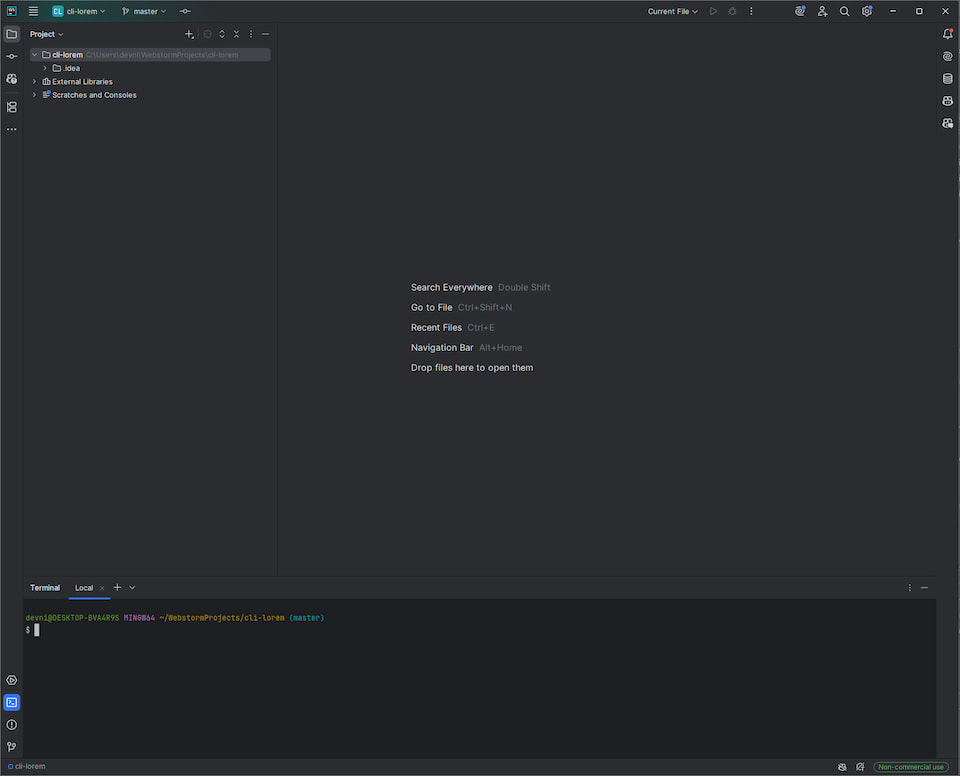

### Шаг 2: Инициализация npm

Запусти команду `npm init`, чтобы создать файл `package.json`. Это файл с метаданными о твоем пакете. Ответь на вопросы, которые задаст npm:

```bash
npm init
```

Рекомендуемые значения:

| Поле            | Значение                              |
|-----------------|---------------------------------------|
| **name**        | `cli-lorem` или `@yourusername/cli-lorem` |
| **version**     | `1.0.0`                              |
| **description** | CLI-инструмент для вывода lorem ipsum |
| **entry point** | Оставь `index.js` (мы не будем его использовать) |
| **test command**| Оставь пустым                      |
| **git repository** | URL репозитория (если есть)        |
| **keywords**    | `lorem`, `ipsum`, `cli`, `generator` |
| **author**      | Твое имя и email                     |
| **license**     | `MIT`                                |

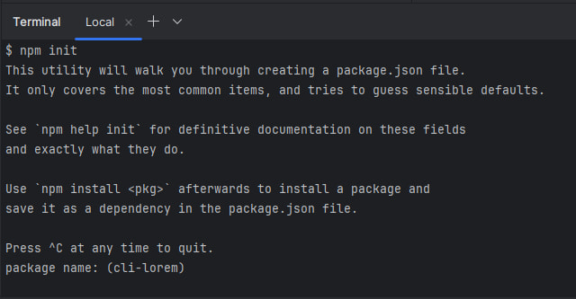
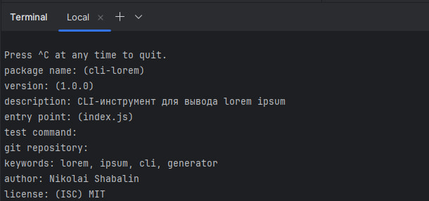

После этого появится файл `package.json`, который будет выглядеть примерно так:

```json
{
  "name": "cli-lorem",
  "version": "1.0.0",
  "description": "CLI-инструмент для вывода lorem ipsum",
  "main": "index.js",
  "scripts": {
    "test": "echo \"Error: no test specified\" && exit 1"
  },
  "keywords": ["lorem", "ipsum", "cli", "generator"],
  "author": "Твое имя",
  "license": "MIT"
}
```

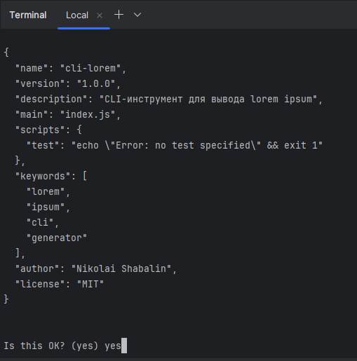

**Совет**: Поле `main` указывает на основной файл модуля, но для CLI-инструмента оно не обязательно, так как мы будем использовать поле `bin`.

## Написание CLI-скрипта
### Шаг 1: Создание файла
Создай файл `cli.js` в корневой директории проекта. Этот файл будет содержать код нашего инструмента.

### Шаг 2: Добавление shebang
В начале файла добавь строку `shebang`, чтобы указать, что скрипт должен выполняться с помощью Node.js:

```javascript
#!/usr/bin/env node
```

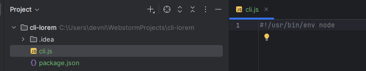

Без этой строки твой скрипт не будет работать как команда в терминале.

### Шаг 3: Определение текста lorem ipsum
Поскольку мы не используем сторонние библиотеки, текст lorem ipsum будет храниться как константа. Вот стандартный параграф, который мы будем использовать:

```javascript
const LOREM_IPSUM = "Lorem ipsum dolor sit amet, consectetur adipiscing elit, sed do eiusmod tempor incididunt ut labore et dolore magna aliqua. Ut enim ad minim veniam, quis nostrud exercitation ullamco laboris nisi ut aliquip ex ea commodo consequat. Duis aute irure dolor in reprehenderit in voluptate velit esse cillum dolore eu fugiat nulla pariatur. Excepteur sint occaecat cupidatat non proident, sunt in culpa qui officia deserunt mollit anim id est laborum.";
```

Этот текст содержит 445 символов, чего достаточно для большинства случаев. Если тебе нужен более длинный текст, ты можешь добавить еще параграфы.

### Шаг 4: Полный код скрипта
Теперь напишем код, который обрабатывает аргументы командной строки, повторяет текст до нужной длины и выводит его:

**cli.js**

```javascript
#!/usr/bin/env node

const LOREM_IPSUM = "Lorem ipsum dolor sit amet, consectetur adipiscing elit, sed do eiusmod tempor incididunt ut labore et dolore magna aliqua. Ut enim ad minim veniam, quis nostrud exercitation ullamco laboris nisi ut aliquip ex ea commodo consequat. Duis aute irure dolor in reprehenderit in voluptate velit esse cillum dolore eu fugiat nulla pariatur. Excepteur sint occaecat cupidatat non proident, sunt in culpa qui officia deserunt mollit anim id est laborum.";

// Берём аргументы командной строки, пропуская первые два (node и имя скрипта)
const args = process.argv.slice(2);

// Ищем индекс флага ‑n
const nIndex = args.indexOf('-n');

// Если флага нет или за ним нет значения — выводим подсказку и завершаем работу
if (nIndex === -1 || nIndex + 1 >= args.length) {
  console.error('Использование: cli-lorem -n <число>'); // сообщение об ошибке
  process.exit(1); // немедленный выход из программы с кодом 1
}

// Преобразуем аргумент после ‑n в целое число — это требуемая длина текста
const length = parseInt(args[nIndex + 1]);

// Проверяем, что введено положительное целое число; иначе — ошибка и выход
if (isNaN(length) || length <= 0) {
  console.error('Укажите положительное целое число для количества символов'); // сообщение об ошибке
  process.exit(1); // завершаем программу
}

// Вычисляем, сколько раз нужно повторить шаблонный текст, чтобы покрыть заданную длину
const repeats = Math.ceil(length / LOREM_IPSUM.length);

// Формируем результат: повторяем LOREM_IPSUM, соединяем пробелами и обрезаем до нужного количества символов
const text = Array(repeats).fill(LOREM_IPSUM).join(' ').slice(0, length);

// Выводим итоговый текст в консоль
console.log(text);
```

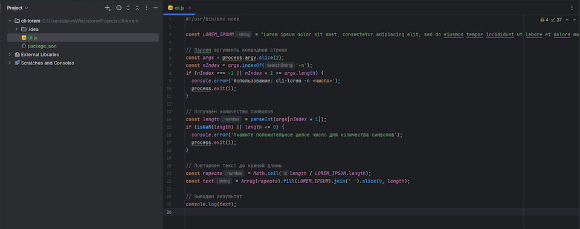

**Как это работает:**

- **Shebang**: Указывает, что скрипт выполняется через Node.js.
- **Константа**: `LOREM_IPSUM` содержит текст lorem ipsum.
- **Аргументы**: `process.argv.slice(2)` извлекает аргументы, начиная с пользовательских флагов. Мы ищем `-n` и значение после него.
- **Проверка**: Если флаг `-n` отсутствует или значение не является положительным числом, выводится ошибка, и процесс завершается.
- **Повтор текста**: Рассчитываем, сколько раз нужно повторить параграф (`Math.ceil(length / LOREM_IPSUM.length)`), создаем массив с повторениями, соединяем их пробелами и обрезаем до нужной длины.
- **Вывод**: Обрезанный текст выводится в консоль.

**Совет**: Обрезка может разрезать слово пополам. Для улучшения можно обрезать до последнего пробела, но для простоты мы оставим так.

## Настройка запуска из терминала
Чтобы команда `cli-lorem` работала в терминале, добавь поле `bin` в `package.json`:

```json
"bin": {
  "cli-lorem": "./cli.js"
}
```

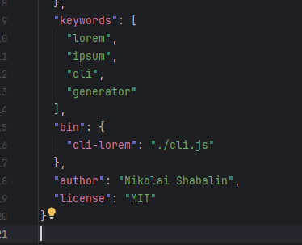

Это указывает npm, что команда `cli-lorem` должна запускать `cli.js`. После установки пакета (локально или глобально) команда станет доступной.

## Тестирование локально
### Тестирование через Node.js
Сначала протестируй скрипт напрямую:

```bash
node cli.js -n 100
```

Ты должен увидеть примерно 100 символов текста lorem ipsum, например:

```
Lorem ipsum dolor sit amet, consectetur adipiscing elit, sed do eiusmod tempor incididunt ut labore et dolore magna aliqua.
```

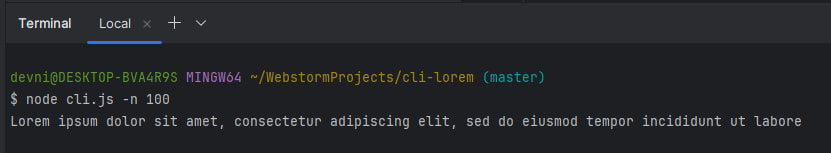

Если появляется ошибка, например, `Использование: cli-lorem -n <число>`, проверь правильность команды.

### Тестирование команды
Чтобы протестировать команду `cli-lorem`, используй `npm link`:

```bash
npm link
```

Эта команда создает глобальную ссылку на твой пакет, позволяя запускать `cli-lorem` из терминала:

```bash
cli-lorem -n 100
```

Если всё работает, ты увидишь тот же результат. Если нет, проверь код и `package.json`.

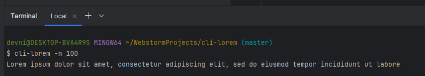

После тестирования удали ссылку:

```bash
npm unlink cli-lorem
```

## Публикация на npm
### Шаг 1: Проверка имени

Убедись, что имя пакета уникально. Проверь на [npmjs.com](https://www.npmjs.com) или выполни:

```bash
npm search cli-lorem
```

Если имя занято, используй область видимости, например `@yourusername/cli-lorem`.

### Шаг 2: Регистрация на npm
Если у тебя нет учетной записи npm, создай ее на [npmjs.com](https://www.npmjs.com).

### Шаг 3: Вход в систему
Войди в свою учетную запись:

```bash
npm login
```

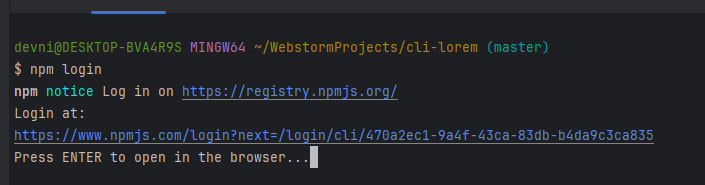

Введи имя пользователя, пароль и email или перейдите в браузер.

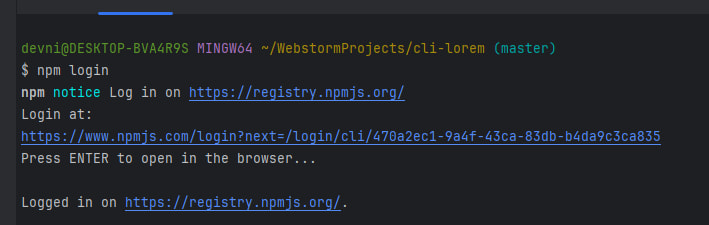

### Шаг 4: Публикация
Опубликуй пакет:

```bash
npm publish
```

Для пакета с областью видимости добавь флаг `--access public`:

```bash
npm publish --access public
```

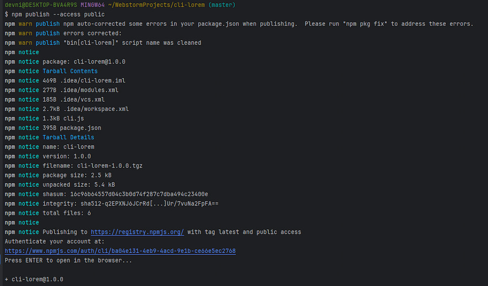

После публикации твой пакет станет доступен для установки:

```bash
npm install -g cli-lorem
```

И использования:

```bash
cli-lorem -n 100
```

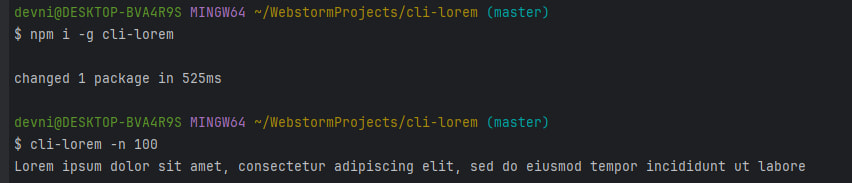

## Использование с помощью `npx`
Нашим пакетом также можно пользоваться с помощью команды `npx`. Можно сказать без установки в `-g` глобальную область.

```bash
npx cli-lorem -n 100
```

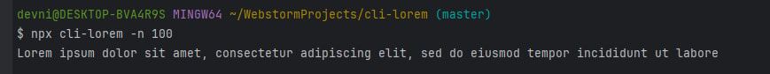

## Дополнительные советы

- **README.md**: Создай файл `README.md` с инструкциями по установке и использованию. Пример:

```
# cli-lorem
CLI-инструмент для генерации текста lorem ipsum.

## Установка
npm install -g cli-lorem

## Использование
cli-lorem -n <число>

Пример:
cli-lorem -n 100

Выводит 100 символов текста lorem ipsum.
```

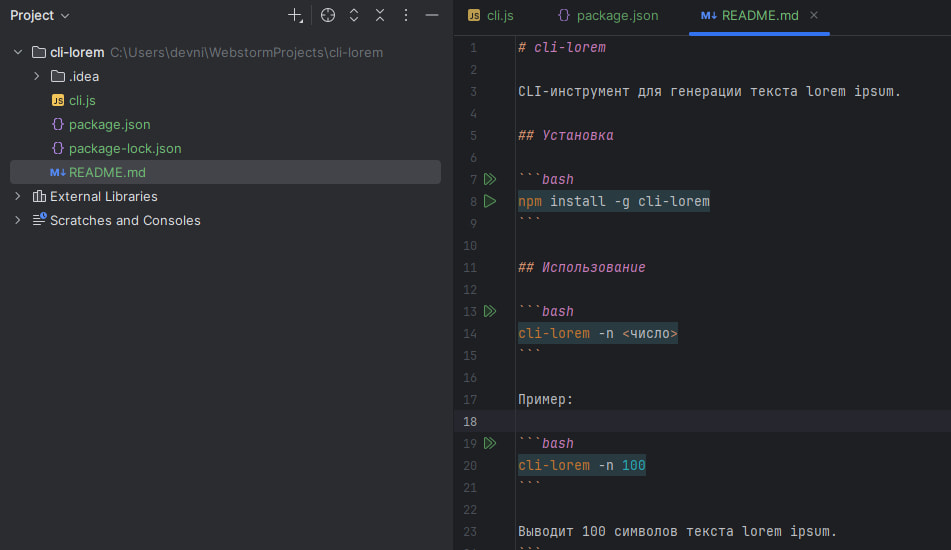

## Увеличение версий
Рано или поздно захочется добавить новые функции, исправить ошибки или улучшить код. Чтобы пользователи получили эти изменения, нужно обновить версию пакета и опубликовать его заново. Я покажу, как это сделать правильно, используя семантическое версионирование и команды npm.

### Что такое семантическое версионирование?
`npm` использует семантическое версионирование ([SemVer](https://semver.org/)), где версия пакета записывается в формате `MAJOR.MINOR.PATCH`. Каждое число имеет свое значение:
- **MAJOR** (например, `2.0.0`): Увеличивается при внесении несовместимых изменений (breaking changes), которые могут сломать существующий код пользователей.
- **MINOR** (например, `1.1.0`): Увеличивается при добавлении новых функций, совместимых с предыдущими версиями.
- **PATCH** (например, `1.0.1`): Увеличивается при исправлении ошибок или небольших улучшениях, не влияющих на функциональность.

Например, если текущая версия твоего пакета `cli-lorem` — `1.0.0`, то:
- Исправление бага → `1.0.1 `(patch).
- Добавление нового флага `-w `для вывода слов → `1.1.0` (minor).
- Полная переработка логики, ломающая старый API → `2.0.0` (major).

### Обновление версии
Выбери, какой тип обновления тебе нужен, и выполни соответствующую команду:

```bash
npm version patch
```

Например, с `1.0.0 `→ `1.0.1`.

#### Что происходит при выполнении команды
Команда npm version:
- Обновляет поле `version` в `package.json`.
- Создает git-коммит с сообщением, например, `v1.0.1`.
- Создает git-тег с новой версией (например, `v1.0.1`).

После выполнения ты увидишь новую версию в package.json, например:
```json
{
  "name": "cli-lorem",
  "version": "1.0.1",
  "description": "CLI-инструмент для вывода lorem ipsum",
  ...
}
```

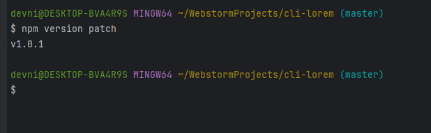

## Публикация новой версии
Публикация новой версии происходит точно также:

```bash
npm publish
```

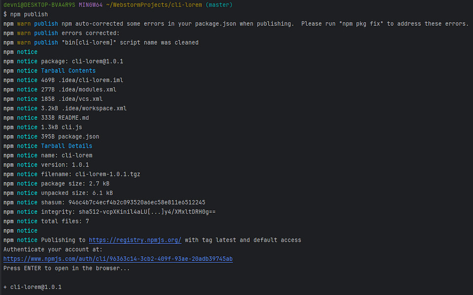

Поздравляю! Ты создал и опубликовал свой первый npm-пакет. Теперь ты знаешь, как настроить проект, написать CLI-скрипт, сделать его исполняемым и поделиться с миром. Это ценный навык, который открывает двери для создания и публикации других проектов. Продолжай экспериментировать, добавляй новые функции и делись своими идеями с сообществом!
