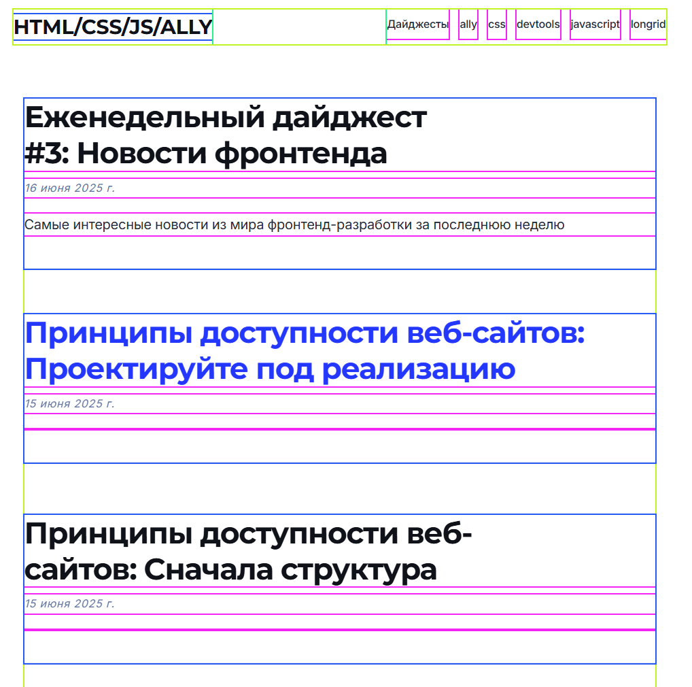
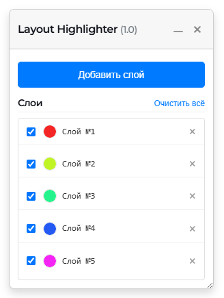

Сегодня я хочу представить расширение для браузера **Layout Highlighter**.

> **Установить расширение:** [Layout Highlighter в Chrome Web Store](https://chromewebstore.google.com/detail/layout-highlighter/afnlmfcnkkmgmkklnjlbijphkncglplf)

В процессе создания сложных веб-интерфейсов мы часто сталкиваемся с необходимостью понимать и отлаживать структуру DOM-дерева. Как элементы вложены друг в друга? Какие из них влияют на раскладку? Где заканчивается один блок и начинается другой? Ответы на эти вопросы не всегда очевидны, особенно в проектах с глубокой вложенностью компонентов. Layout Highlighter призван решить именно эту задачу — визуализировать структуру страницы, делая её наглядной и понятной.

## Что это и зачем?
Представьте, что вы можете «просветить» веб-страницу, и каждый уровень DOM-дерева будет обведен рамкой своего цвета. Это позволяет мгновенно оценить структуру разметки, выявить проблемы с выравниванием, отступами или некорректной вложенностью.

Основная цель инструмента — ускорить процесс отладки вёрстки. Вместо того чтобы поочередно инспектировать элементы в DevTools, вы получаете целостную картину прямо в окне браузера.

## Как это работает?

Принцип работы расширения элегантен в своей простоте. После установки, клик по иконке расширения на панели инструментов активирует на странице специальную панель управления и внедряет CSS-стили.

Панель позволяет добавлять «слои» подсветки. Каждый новый слой применяет CSS-правило `outline` к элементам на следующем уровне вложенности, начиная от прямых потомков `<body>`.

1.  **Первый слой:** подсвечивает `body > *`
2.  **Второй слой:** подсвечивает `body > * > *`
3.  **Третий слой:** `body > * > * > *`, и так далее.

Для каждого слоя автоматически подбирается свой уникальный, контрастный цвет. Использование свойства `outline` вместо `border`, поскольку оно не влияет на размеры элементов и, следовательно, не «ломает» саму раскладку страницы в процессе отладки.

Пользователь имеет полный контроль над процессом:
*   **Добавление и удаление слоев:** можно гибко настраивать глубину анализа.
*   **Настройка цвета:** цвет каждого слоя можно изменить для лучшего визуального восприятия.
*   **Включение/выключение слоев:** любой слой можно временно деактивировать, не удаляя его.

Все настройки сохраняются для текущей вкладки, что позволяет продолжать работу даже после перезагрузки страницы.

## Практическое применение
Когда этот инструмент может быть особенно полезен?
*   **Анализ незнакомой вёрстки:** при работе с чужим кодом или сложными CMS-темами расширение помогает быстро сориентироваться в структуре страницы.
*   **Отладка z-index:** визуализация границ блоков помогает понять, какой элемент находится выше и почему он перекрывает другие.
*   **Обучение:** для начинающих разработчиков это прекрасная возможность наглядно увидеть, как браузер строит страницу из отдельных HTML-тегов.

